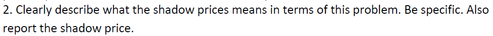

  

  
Max should eat 30 tortes and 0 pies to get 120 points.
  
Choose: t, p  
Objective: max 4t + 5p  
Constraint: 2t + 3p <= 60  

```{r}
# verifying in R
library(lpSolve)

c <- c(4, 5)
A1 <- matrix(c(2, 3), 1, 2)
dir1 <- c("<=")
b1 <- c(60)
s1 <- lp("max", c, A1, dir1, b1)
s1$solution
s1$objval
```
  

  
If the number of pies Max eats must be greater than or equal to the number of tortes he eats, then Max will eat 12 pies and 12 tortes. This would give him a total of 108 points, 12 less than before.
  
Choose: t, p  
Objective: max 4t + 5p  
Constraints:  
2t + 3p <= 60  
-t + p >= 0  
  
```{r}
# verifying in R
A2 <- matrix(c(2, -1, 3, 1), 2, 2)
dir2 <- c("<=", ">=")
b2 <- c(60, 0)
s2 <- lp("max", c, A2, dir2, b2)
s2$solution
s2$objval

s1$objval - s2$objval
```
  

  
He should plant 200 acres of wheat and 200 acres of corn, which will yield $1M in profit.  
  
Choose: w, c  
Objective: max 2000w + 3000c  
Constraints:  
3w + 2c <= 1000  
2w + 4c <= 1200  
w + c <= 450  
w, c >= 0  
  

```{r}
# solving in R
c <- c(2000, 3000)
A <- matrix(c(3, 2, 1, 2, 4, 1), 3, 2)
dir <- c("<=", "<=", "<=")
b <- c(1000, 1200, 450)
s <- lp("max", c, A, dir, b, compute.sens=1)
s$solution
s$objval
```

  
The farmer discontinues producing wheat when the availability of fertilizer increases to 1800 tons. He stops producing corn when the availability of fertilizer drops to 600 tons.
```{r}
f <- seq(200, 2200, 100) # 100-ton increments of fertilizer availability
df <- data.frame(fertilizer=numeric(0), wheat=numeric(0), corn=numeric(0)) # dataframe to store results
for(i in f) # loop through fertilizer availabilities
{
  b <- c(1000, i, 450) # rhs of constraints
  s2 <- lp("max", c, A, dir, b) # solve
  df <- rbind(df, data.frame(fertilizer=i, wheat=s2$solution[1], corn=s2$solution[2]))
}
df
```

  
No, duals.from and duals.to tell us the range of coefficients under which the optimal solution remains the same and the shadow prices tell us how much the objective will improve when the constraint is relaxed by 1 unit. Using this information, we cannot tell when the farmer will discontinue wheat/corn production.
```{r}
s$duals
s$duals.from
s$duals.to
```
  

  
Star Oil should purchase 1.0000000, 0.2008600, 1.0000000, 1.0000000, and 0.2880835 of investment 1, 2, 3, 4, and 5, which would yield a NPV of $57.45M.
  
Choose: x1, ..., x5  
Objective: max 13x1 + 16x2 + 16x3 + 14x4 + 39x5  
Constraints:  
11x1 + 53x2 + 5x3 + 5x4 + 29x5 <= 40  
3x1 + 6x2 + 5x3 + x4 + 34x5 <= 20  
x1, x2, x3, x4, x5 <= 1  
x1, x2, x3, x4, x5 >= 0
```{r}
c <- c(13, 16, 16, 14, 39)
A <- matrix(c(11, 3, 1, 0, 0, 0, 0, 53, 6, 0, 1, 0, 0, 0, 5, 5, 0, 0, 1, 0, 0, 5, 1, 0, 0, 0, 1, 0, 29, 34, 0, 0, 0, 0, 1), 7, 5)
dir <- rep("<=", 7)
b <- c(40, 20, 1, 1, 1, 1, 1)
s <- lp("max", c, A, dir, b, all.int=FALSE)
s$solution
s$objval
```
  

  
The optimal diet is 1.94 servings of corn, 10 servings of milk, and 10 servings of bread, which would cost $3.15.
  
Choose: c, m, b  
Objective: min 0.18c + 0.23m + 0.05b  
Constraints:  
72c + 121m + 65b >= 2000  
72c + 121m + 65b <= 2250  
107c + 500m >= 5000  
107c + 500m <= 50000  
c, m, b <= 10
```{r}
c <- c(.18, .23, .05)
A <- matrix(c(72, 72, 107, 107, 1, 0, 0, 121, 121, 500, 500, 0, 1, 0, 65, 65, 0, 0, 0, 0, 1), 7, 3)
dir <- c(">=", "<=", ">=", "<=", "<=", "<=", "<=")
b <- c(2000, 2250, 5000, 50000, 10, 10, 10)
s <- lp("min", c, A, dir, b)
s$solution
s$objval
```


  
The furniture company should produce 1,333.33 finished chairs to generate $106,666.70 in profit.
  
Choose: ut, ft, uc, fc  
Objective: max 30ut + 100ft + 30uc + 80fc  
Constraints:  
40ut + 40ft + 30uc + 30fc <= 40000  
2ut + 5ft + 2uc + 4fc <= 6000
```{r}
c <- c(30, 100, 30, 80)
A <- matrix(c(40, 20, 40, 5, 30, 2, 30, 4), 2, 4)
dir <- c("<=", "<=")
b <- c(40000, 6000)
s <- lp("max", c, A, dir, b, compute.sens=1)
s$solution
s$objval
```

  
The shadow price for the 1st constraint is 2.666667, meaning profit will increase 2.666667 given an additional board foot of wood. The shadow price for the 2nd constraint is 0 because the constraint is unbounded. Unfinished table has a shadow price of -76.666667, meaning if production of unfinished tables had a constraint of >= 1, profits would drop by -76.666667. The same goes for finished table and unfinished chair which have shadow prices of -6.666667 and -50. Increasing the constraint for finished chair would not change profit.
```{r}
s$duals
```