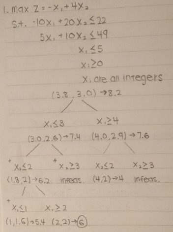
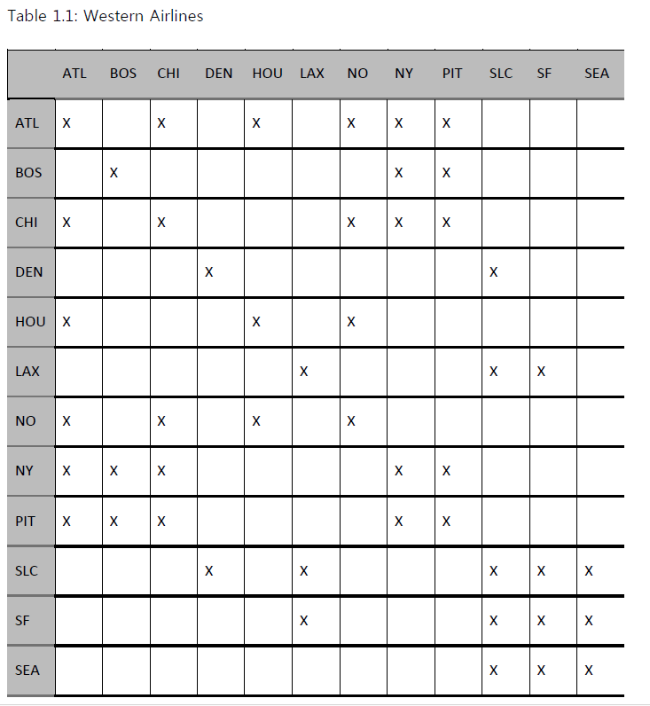

# Homework 3


  
The solution is (2, 2) which gives you 6.
  



```r
library(lpSolve)

# verifying in R
# Original
c <- c(-1, 4)
A <- matrix(c(-10, 5, 1, 20, 10, 0), 3, 2)
dir <- rep("<=", 3)
b <- c(22, 49, 5)
s <- lp("max", c, A, dir, b)
s$status
```

```
## [1] 0
```

```r
s$solution
```

```
## [1] 3.8 3.0
```

```r
s$objval
```

```
## [1] 8.2
```

```r
# x1 <= 3
A <- matrix(c(-10, 5, 1, 1, 20, 10, 0, 0), 4, 2)
dir <- rep("<=", 4)
b <- c(22, 49, 5, 3)
s <- lp("max", c, A, dir, b)
s$status
```

```
## [1] 0
```

```r
s$solution
```

```
## [1] 3.0 2.6
```

```r
s$objval
```

```
## [1] 7.4
```

```r
# x1 <= 3 & x2 <= 2
A <- matrix(c(-10, 5, 1, 1, 0, 20, 10, 0, 0, 1), 5, 2)
dir <- rep("<=", 5)
b <- c(22, 49, 5, 3, 2)
s <- lp("max", c, A, dir, b)
s$status
```

```
## [1] 0
```

```r
s$solution
```

```
## [1] 1.8 2.0
```

```r
s$objval
```

```
## [1] 6.2
```

```r
# x1 <= 3 & x2 <= 2 & x1 <= 1
A <- matrix(c(-10, 5, 1, 1, 0, 1, 20, 10, 0, 0, 1, 0), 6, 2)
dir <- rep("<=", 6)
b <- c(22, 49, 5, 3, 2, 1)
s <- lp("max", c, A, dir, b)
s$status
```

```
## [1] 0
```

```r
s$solution
```

```
## [1] 1.0 1.6
```

```r
s$objval
```

```
## [1] 5.4
```

```r
# x1 <= 3 & x2 <= 2 & x1 >= 2
A <- matrix(c(-10, 5, 1, 1, 0, 1, 20, 10, 0, 0, 1, 0), 6, 2)
dir <- c(rep("<=", 5), ">=")
b <- c(22, 49, 5, 3, 2, 2)
s <- lp("max", c, A, dir, b)
s$status
```

```
## [1] 0
```

```r
s$solution
```

```
## [1] 2 2
```

```r
s$objval
```

```
## [1] 6
```

```r
# x1 <= 3 & x2 >= 3
A <- matrix(c(-10, 5, 1, 1, 0, 20, 10, 0, 0, 1), 5, 2)
dir <- c(rep("<=", 4), ">=")
b <- c(22, 49, 5, 3, 3)
s <- lp("max", c, A, dir, b)
s$status #infeasible
```

```
## [1] 2
```

```r
s$solution
```

```
## [1] 0 0
```

```r
s$objval
```

```
## [1] 0
```

```r
# x1 >= 4
A <- matrix(c(-10, 5, 1, 1, 20, 10, 0, 0), 4, 2)
dir <- c(rep("<=", 3), ">=")
b <- c(22, 49, 5, 4)
s <- lp("max", c, A, dir, b)
s$status
```

```
## [1] 0
```

```r
s$solution
```

```
## [1] 4.0 2.9
```

```r
s$objval
```

```
## [1] 7.6
```

```r
# x1 >= 4 & x2 <= 2
A <- matrix(c(-10, 5, 1, 1, 0, 20, 10, 0, 0, 1), 5, 2)
dir <- c(rep("<=", 3), ">=", "<=")
b <- c(22, 49, 5, 4, 2)
s <- lp("max", c, A, dir, b)
s$status
```

```
## [1] 0
```

```r
s$solution
```

```
## [1] 4 2
```

```r
s$objval
```

```
## [1] 4
```

```r
# x1 >= 4 & x2 >= 3
A <- matrix(c(-10, 5, 1, 1, 0, 20, 10, 0, 0, 1), 5, 2)
dir <- c(rep("<=", 3), ">=", ">=")
b <- c(22, 49, 5, 4, 3)
s <- lp("max", c, A, dir, b)
s$status
```

```
## [1] 2
```

```r
s$solution
```

```
## [1] 0 0
```

```r
s$objval
```

```
## [1] 0
```

```r
c <- c(-1, 4)
A <- matrix(c(-10, 5, 1, 20, 10, 0), 3, 2)
dir <- rep("<=", 3)
b <- c(22, 49, 5)
s <- lp("max", c, A, dir, b, all.int=TRUE)
s$status
```

```
## [1] 0
```

```r
s$solution
```

```
## [1] 2 2
```

```r
s$objval
```

```
## [1] 6
```


  
There are 8 branches and 6 feasible solutions. The difference is 2 because there are 2 infeasible branches.


  
The optimal investment strategy is a factory in Austin, a factory in Dallas, and a warehouse in Dallas.

```r
c <- c(9, 5, 6, 4)
A <- matrix(c(6, 1, 3, 1, 5, 0, 2, 0), 2, 4)
A <- rbind(A, diag(4))
dir <- c("<=", ">=", rep("<=", 4))
b <- c(11, rep(1, 5))
s <- lp("max", c, A, dir, b)
s$status
```

```
## [1] 0
```

```r
s$solution
```

```
## [1] 1 1 0 1
```

```r
s$objval
```

```
## [1] 18
```
  




  
  
Sum of the x's >= 1.
  

  
The minimum number of hub locations to cover all cities is 3.

```r
# solving in R
c <- rep(1, 12)
atl = c(1,0,1,0,1,0,1,1,1,0,0,0)
bos = c(0,1,0,0,0,0,0,1,1,0,0,0)
chi = c(1,0,1,0,0,0,1,1,1,0,0,0)
den = c(0,0,0,1,0,0,0,0,0,1,0,0)
hou = c(1,0,0,0,1,0,1,0,0,0,0,0)
lax = c(0,0,0,0,0,1,0,0,0,1,1,0)
no = c(1,0,1,0,1,0,1,0,0,0,0,0)
ny = c(1,1,1,0,0,0,0,1,1,0,0,0)
pit = c(1,1,1,0,0,0,0,1,1,0,0,0) 
slc = c(0,0,0,1,0,1,0,0,0,1,1,1)
sf = c(0,0,0,0,0,1,0,0,0,1,1,1)
sea = c(0,0,0,0,0,0,0,0,0,1,1,1)
A <- matrix(c(atl, bos, chi, den, hou, lax, no, ny, pit, slc, sf, sea), 12, 12)
dir <- rep(">=", 12)
b <- rep(1, 12)
s <- lp("min", c, A, dir, b)
s$status
```

```
## [1] 0
```

```r
s$solution
```

```
##  [1] 1 0 0 0 0 0 0 1 0 1 0 0
```

```r
s$objval
```

```
## [1] 3
```
  


  


  
The optimal solution is:  
- 7 rolls cut into two 54-inch pieces  
- 3 rolls cut into three 37-inch pieces 
- 47 rolls cut into three 25-inch pieces and one 37-inch piece  
- 92 rolls cut into one 25-inch, one 37-inch, and one 54-inch piece  
  
This will result in 855 inches of waste.

```r
# solving in R
c <- c(95, 83, 70, 66, 58, 46, 45, 41, 33, 29, 21, 20, 16, 12, 9, 8, 4)
A <- matrix(c(1, 0, 0, 0, 1, 0, 2, 0, 0, 0, 0, 1, 1, 1, 0, 0, 2, 0, 3, 0, 0, 1, 0, 1, 2, 1, 0, 0, 1, 1, 1, 2, 0, 4, 0, 0, 2, 0, 1, 0, 0, 2, 0, 3, 0, 3, 1, 0, 1, 1, 1), 3, 17)
dir <- rep("=", 3)
b <- c(233, 148, 106)
s <- lp("min", c, A, dir, b, all.int=TRUE)
s$status
```

```
## [1] 0
```

```r
s$solution
```

```
##  [1]  0  0  0  0  0  0  0  0  0  0  0  0  0  7  3 47 92
```

```r
s$objval
```

```
## [1] 855
```
  


  


  
- 1 person will work Sun-Thu
- 8 people will work Mon-Fri
- 2 people will work Tue-Sa
- 3 people will work Thu-Mon
- 1 person will work Sa-Wed
  
This will cost 4,830.

```r
# solving in R
c <- c(330, 300, 330, 360, 360, 360, 360)
A <- matrix(c(1, 1, 1, 1, 1, 0, 0, 0, 1, 1, 1, 1, 1, 0, 0, 0, 1, 1, 1, 1, 1, 1, 0, 0, 1, 1, 1, 1, 1, 1, 0, 0, 1, 1, 1, 1, 1, 1, 0, 0, 1, 1, 1, 1, 1, 1, 0, 0, 1), 7, 7)
dir <- rep(">=", 7)
b <- c(5, 13, 12, 10, 14, 8, 6)
s <- lp("min", c, A, dir, b, all.int=TRUE)
s$status
```

```
## [1] 0
```

```r
s$solution
```

```
## [1] 1 8 2 0 3 0 1
```

```r
s$objval
```

```
## [1] 4830
```
  

  
Monday to Friday is the most popular work schedule.
