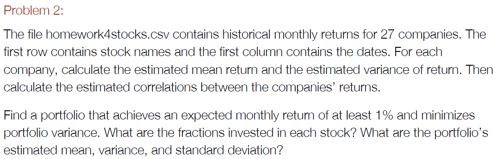
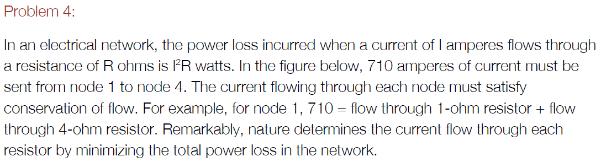
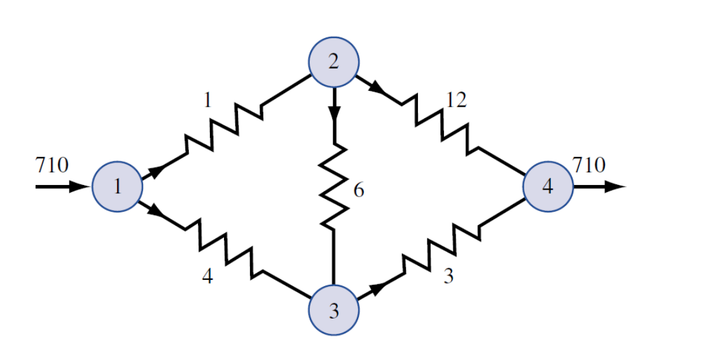
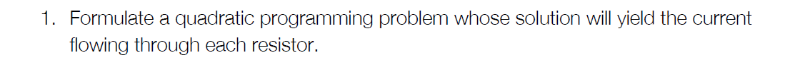
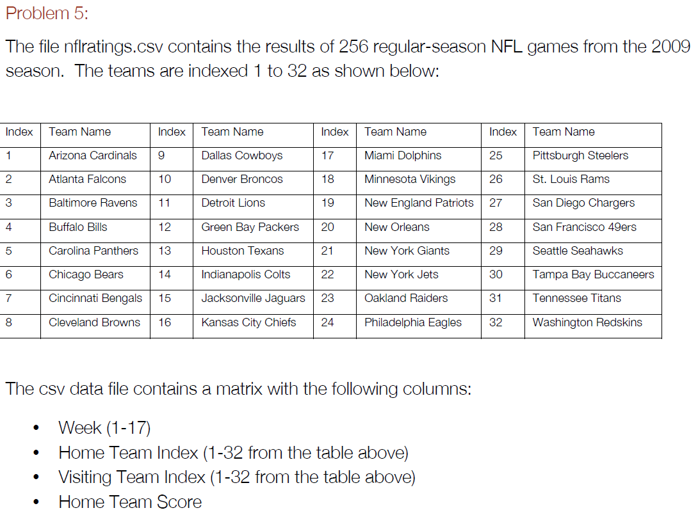

# Homework 4

  

  
The maximum number of machines that can be produced is 204.

```r
library(quadprog)

func <- function(L){ # function for num of machines produced given a level of L
  K = (100000 - 12*L)/15
  num_machines = 0.05*L^(2/3)*K^(1/3)
  return(-num_machines)
}
S = optim(2000, func, method="BFGS")
S
```

```
## $par
## [1] 5649.843
## 
## $value
## [1] -204.6088
## 
## $counts
## function gradient 
##        5        4 
## 
## $convergence
## [1] 0
## 
## $message
## NULL
```
  

  
The fractions invested in each stock are shown below under $solution. The mean return is 1%, the variance is -0.0001, and the standard deviation is 0.035.

```r
stocks <- read.csv("homework4stocks.csv")
mean_return = colMeans(stocks[,2:ncol(stocks)])
var = apply(stocks[,2:ncol(stocks)], 2, var)
s = sqrt(var)
corr = cor(stocks[,2:ncol(stocks)], use="pairwise.complete.obs")

covMat = diag(s) %*% corr %*% diag(s)
Dmat = 2*covMat
dvec = rep(0,27)
Amat = matrix(c(rep(1,27),rep(-1,27),mean_return),27)
bvec = c(1,-1,0.01)

S=solve.QP(Dmat,dvec,Amat,bvec)
S
```

```
## $solution
##  [1] -0.11973810  0.03867549 -0.07492591  0.16636830 -0.01034152
##  [6]  0.02541211 -0.07436094 -0.09669737 -0.03890179  0.01443292
## [11] -0.11294606 -0.05983834  0.09727562  0.06822219  0.16038834
## [16]  0.11682045 -0.07211667  0.07338738  0.02102473  0.01460696
## [21]  0.22763626 -0.07466514 -0.02873011  0.13824440  0.20171402
## [26]  0.01403427  0.38501850
## 
## $value
## [1] 0.0004698333
## 
## $unconstrained.solution
##  [1] 0 0 0 0 0 0 0 0 0 0 0 0 0 0 0 0 0 0 0 0 0 0 0 0 0 0 0
## 
## $iterations
## [1] 3 0
## 
## $Lagrangian
## [1] 0.0007860884 0.0000000000 0.0153578157
## 
## $iact
## [1] 1 3
```

```r
sum(S$solution * mean_return)
```

```
## [1] 0.01
```

```r
sum(S$solution * var)
```

```
## [1] -0.0001122938
```

```r
sum(S$solution * sqrt(var))
```

```
## [1] 0.03455156
```
  

  
lm4 which includes x1 and x2 has the lowest sum of squared residuals and fits the data best.

```r
variables <- read.csv("variable_selection.csv")

lm1 = lm(variables$y ~ variables$x1)
lm2 = lm(variables$y ~ variables$x2)
lm3 = lm(variables$y ~ variables$x3)
lm4 = lm(variables$y ~ variables$x1 + variables$x2)
lm5 = lm(variables$y ~ variables$x2 + variables$x3)
lm6 = lm(variables$y ~ variables$x3 + variables$x1)

sum(resid(lm1)^2)
```

```
## [1] 7901.299
```

```r
sum(resid(lm2)^2)
```

```
## [1] 878.8358
```

```r
sum(resid(lm3)^2)
```

```
## [1] 8575.636
```

```r
sum(resid(lm4)^2)
```

```
## [1] 26.19087
```

```r
sum(resid(lm5)^2)
```

```
## [1] 878.1811
```

```r
sum(resid(lm6)^2)
```

```
## [1] 7860.089
```
  



  
Choose x1, x3, x4, x6, x12  
Min sum(xi2 * i)  
S.t.  
x1 + x4 = 710  
x6 + x12 = x1 ??? -x1 + x6 + x12 = 0  
x3 = x4 + x6 ??? x3 - x4 - x6 = 0  
  

  
The current flowing through each resistor is shown below under $solution in the order of x1, ..., x12.
  

```r
Dmat = diag(5)
Dmat[2,2] = 3
Dmat[3,3] = 4
Dmat[4,4] = 6
Dmat[5,5] = 12 
dvec = rep(0,5)
Amat = matrix(c(1,0,1,0,0,-1,0,0,1,1,0,1,-1,-1,0),5,3)
bvec = c(710,0,0)
S=solve.QP(Dmat,dvec,Amat,bvec)
S
```

```
## $solution
## [1] 371.3846 502.4615 338.6154 163.8462 207.5385
## 
## $value
## [1] 1015955
## 
## $unconstrained.solution
## [1] 0 0 0 0 0
## 
## $iterations
## [1] 4 0
## 
## $Lagrangian
## [1] 2861.846 2490.462 1507.385
## 
## $iact
## [1] 1 2 3
```
  


  
Below are the ratings for the 32 NFL teams. The last number is the home team advantage.

```r
nfl <- read.csv('nflratings.csv')
head(nfl)
```

```
##   X1 X25 X31 X13 X10
## 1  1   2  17  19   7
## 2  1  29  26  28   0
## 3  1  21  32  23  17
## 4  1   3  16  38  24
## 5  1  13  22   7  24
## 6  1  20  11  45  27
```

```r
nfl$actual_point_spread = nfl$X13 - nfl$X10
func <- function(R){
  pred_error = 0
  for (i in 1:nrow(nfl)) {
    pred_error = pred_error + (nfl$actual_point_spread[i] - (R[nfl[i,2]] - R[nfl[i,3]] + R[33]))^2
  }
  return(pred_error)
}
S = optim(rep(0, 33), func, method="BFGS")
sol = S$par[1:32] + (85 - mean(S$par[1:32]))
sol = c(sol, S$par[33])
mean(sol[1:32])
```

```
## [1] 85
```

```r
sol
```

```
##  [1] 84.48792 89.83315 92.80631 83.04926 88.75252 79.83926 87.60801
##  [8] 76.94714 92.13457 85.67620 70.53597 92.28773 86.92186 90.79928
## [15] 78.37611 76.92849 86.58862 92.09555 96.08356 95.62021 85.11249
## [22] 93.10867 75.07121 90.97112 86.90721 67.68808 92.63373 85.20902
## [29] 74.69670 79.16269 81.90324 80.16414  2.18786
```
