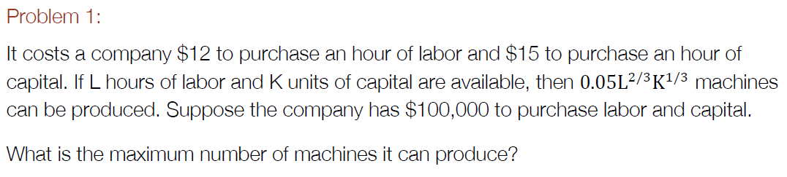
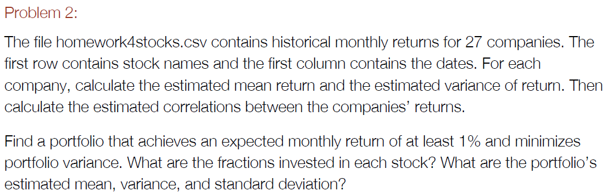
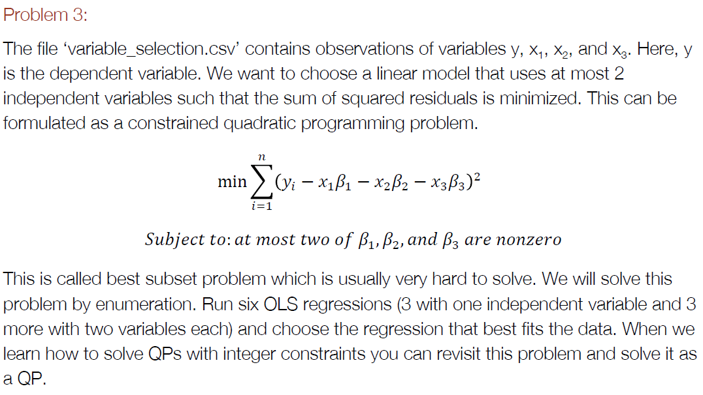
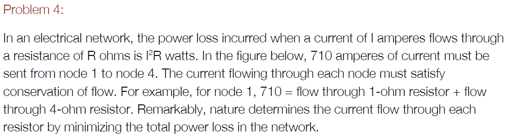
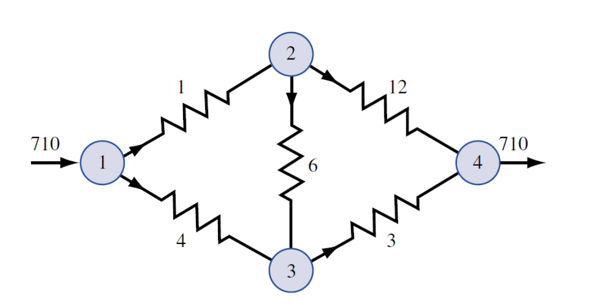
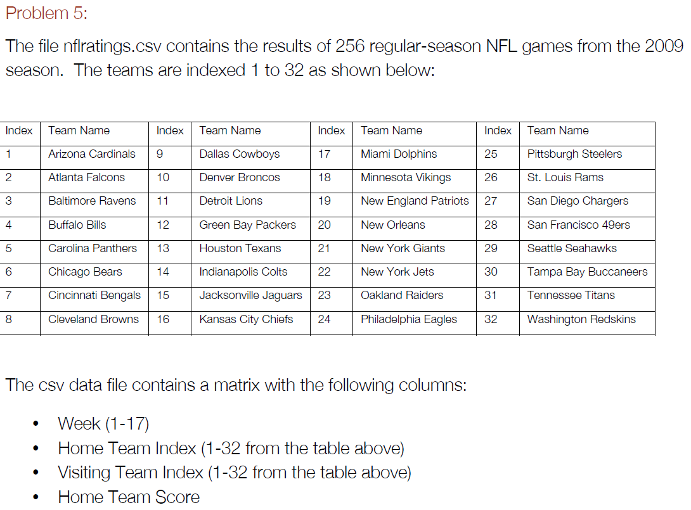
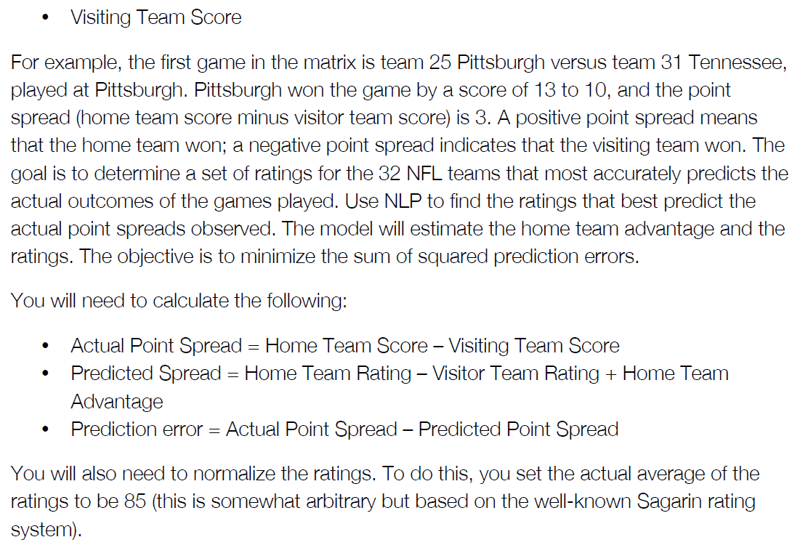

  

  
The maximum number of machines that can be produced is 204.
```{r}
library(quadprog)

func <- function(L){ # function for num of machines produced given a level of L
  K = (100000 - 12*L)/15
  num_machines = 0.05*L^(2/3)*K^(1/3)
  return(-num_machines)
}
S = optim(2000, func, method="BFGS")
S
```
  

  
The fractions invested in each stock are shown below under $solution. The mean return is 1%, the variance is -0.0001, and the standard deviation is 0.035.
```{r}
stocks <- read.csv("homework4stocks.csv")
mean_return = colMeans(stocks[,2:ncol(stocks)])
var = apply(stocks[,2:ncol(stocks)], 2, var)
s = sqrt(var)
corr = cor(stocks[,2:ncol(stocks)], use="pairwise.complete.obs")

covMat = diag(s) %*% corr %*% diag(s)
Dmat = 2*covMat
dvec = rep(0,27)
Amat = matrix(c(rep(1,27),rep(-1,27),mean_return),27)
bvec = c(1,-1,0.01)

S=solve.QP(Dmat,dvec,Amat,bvec)
S
sum(S$solution * mean_return)
sum(S$solution * var)
sum(S$solution * sqrt(var))
```
  

  
lm4 which includes x1 and x2 has the lowest sum of squared residuals and fits the data best.
```{r}
variables <- read.csv("variable_selection.csv")

lm1 = lm(variables$y ~ variables$x1)
lm2 = lm(variables$y ~ variables$x2)
lm3 = lm(variables$y ~ variables$x3)
lm4 = lm(variables$y ~ variables$x1 + variables$x2)
lm5 = lm(variables$y ~ variables$x2 + variables$x3)
lm6 = lm(variables$y ~ variables$x3 + variables$x1)

sum(resid(lm1)^2)
sum(resid(lm2)^2)
sum(resid(lm3)^2)
sum(resid(lm4)^2)
sum(resid(lm5)^2)
sum(resid(lm6)^2)
```
  



  
Choose x1, x3, x4, x6, x12  
Min sum(xi2 * i)  
S.t.  
x1 + x4 = 710  
x6 + x12 = x1 ??? -x1 + x6 + x12 = 0  
x3 = x4 + x6 ??? x3 - x4 - x6 = 0  
  

  
The current flowing through each resistor is shown below under $solution in the order of x1, ..., x12.
  
```{r}
Dmat = diag(5)
Dmat[2,2] = 3
Dmat[3,3] = 4
Dmat[4,4] = 6
Dmat[5,5] = 12 
dvec = rep(0,5)
Amat = matrix(c(1,0,1,0,0,-1,0,0,1,1,0,1,-1,-1,0),5,3)
bvec = c(710,0,0)
S=solve.QP(Dmat,dvec,Amat,bvec)
S
```
  


  
Below are the ratings for the 32 NFL teams. The last number is the home team advantage.
```{r}
nfl <- read.csv('nflratings.csv')
head(nfl)
nfl$actual_point_spread = nfl$X13 - nfl$X10
func <- function(R){
  pred_error = 0
  for (i in 1:nrow(nfl)) {
    pred_error = pred_error + (nfl$actual_point_spread[i] - (R[nfl[i,2]] - R[nfl[i,3]] + R[33]))^2
  }
  return(pred_error)
}
S = optim(rep(0, 33), func, method="BFGS")
sol = S$par[1:32] + (85 - mean(S$par[1:32]))
sol = c(sol, S$par[33])
mean(sol[1:32])
sol
```