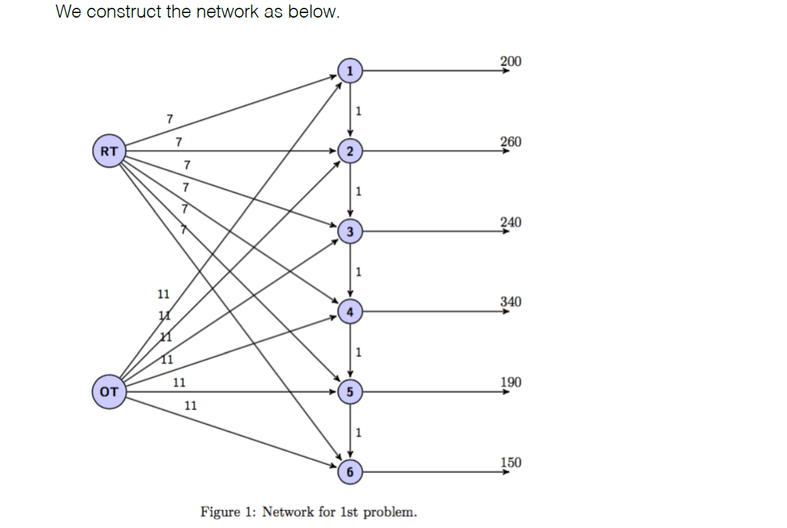
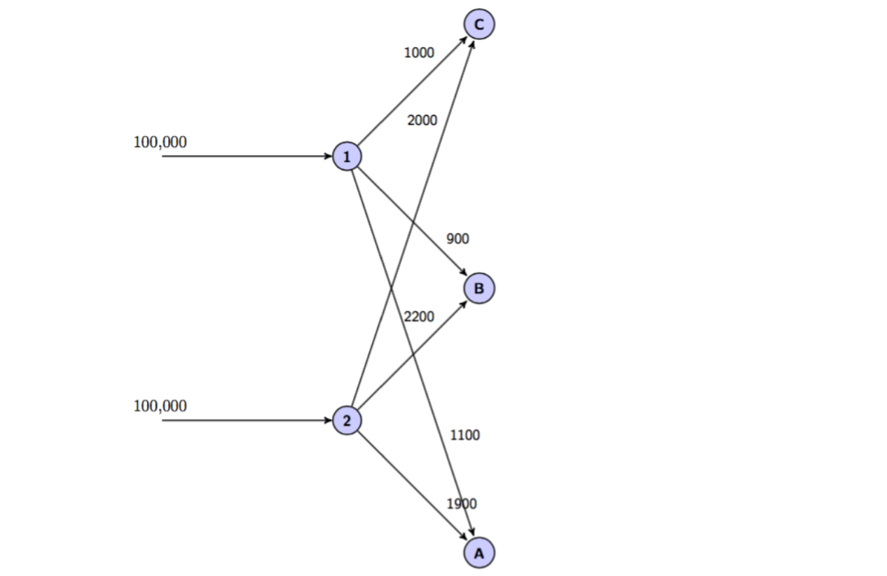

# Homework 5

  


  
The optimal production schedule is shown below under get.variables(lps.model). The total cost of meeting the next six months of demand on time is $10,660.
  
Choose:
x1, x2, ., x6 - Regular  
y1, y2, ., y6 - Overtime  
z2, z3, ., z6 - Carry-over into month i  
Min sum(7xi + 11yi + zi)  
S.t.  
xi <= 200  
yi <= 100  
x1 + y1 >= 200  
x2 + y2 + z2 >= 260  
x3 + y3 + z3 >= 240  
x4 + y4 + z4 >= 340  
x5 + y5 + z5 >= 190  
x6 + y6 + z6 >= 150  
x1 + y1 - z2 = 200  
x2 + y2 + z2 - z3 = 260  
x3 + y3 + z3 - z4 = 240  
x4 + y4 + z4 - z5 = 340  
x5 + y5 + z5 - z6 = 190  
x6 + y6 + z6 = 150

```r
library(lpSolveAPI)

lps.model <- make.lp(0, 17)

for (x in (1:6)) {
  xt <- rep(0,17)
  xt[x] <- 1
  add.constraint(lps.model, xt, "<=", 200)
}

for (y in (7:12)) {
  xt <- rep(0,17)
  xt[y] <- 1
  add.constraint(lps.model, xt, "<=", 100)
}

demand = c(200,260,240,340,190,150)
for (i in (1:6)) {
  xt <- rep(0,17)
  xt[i] <- 1
  xt[i+6] <- 1
  if (i > 1) {
    xt[i+11] <- 1
  }
  add.constraint(lps.model, xt, ">=", demand[i])
}

for (i in (1:6)) {
  xt <- rep(0,17)
  xt[i] <- 1
  xt[i+6] <- 1
  if (i < 6) {
    xt[i+12] <- -1
  }
  if (i > 1) {
    xt[i+11] <- 1
  }
  add.constraint(lps.model, xt, "=", demand[i])
}

set.objfn(lps.model, c(rep(7,6),rep(11,6),rep(1,5)))
solve(lps.model)
```

```
## [1] 0
```

```r
get.variables(lps.model)
```

```
##  [1] 200 200 200 200 190 150   0  60  80 100   0   0   0   0  40   0   0
```

```r
get.objective(lps.model)
```

```
## [1] 10660
```
  



  
Alexis should get 40,000 acres of site 1 and 20,000 acres of site 2. Blake should get 20,000 acres of site 1 and 40,000 acres of site 2. Cliff should get 40,000 acres of site 1 and 40,000 acres of site 2. This will generate $324,000,000 in revenue for the government.
  
Choose: a1, a2, b1, b2, c1, c2  
Max 1100a1 + 1900a2 + 900b1 + 2200b2 + 1000c1 + 2000c2  
S.t.  
a1 + b1 + c1 = 100,000  
a2 + b2 + c2 = 100,000    
a1 + a2 <= 80,000  
b1 + b2 <= 80,000  
c1 + c2 <= 80,000  

```r
lps.model <- make.lp(0, 6)
add.constraint(lps.model, c(1,0,1,0,1,0), "<=", 100000)
add.constraint(lps.model, c(0,1,0,1,0,1), "<=", 100000)
add.constraint(lps.model, c(1,1,0,0,0,0), "<=", 80000)
add.constraint(lps.model, c(0,0,1,1,0,0), "<=", 80000)
add.constraint(lps.model, c(0,0,1,1,0,0), "<=", 80000)
set.objfn(lps.model, c(1100,1900,900,2200,1000,2000))
lp.control(lps.model,sense='max')
```

```
## $anti.degen
## [1] "fixedvars" "stalling" 
## 
## $basis.crash
## [1] "none"
## 
## $bb.depthlimit
## [1] -50
## 
## $bb.floorfirst
## [1] "automatic"
## 
## $bb.rule
## [1] "pseudononint" "greedy"       "dynamic"      "rcostfixing" 
## 
## $break.at.first
## [1] FALSE
## 
## $break.at.value
## [1] 1e+30
## 
## $epsilon
##       epsb       epsd      epsel     epsint epsperturb   epspivot 
##      1e-10      1e-09      1e-12      1e-07      1e-05      2e-07 
## 
## $improve
## [1] "dualfeas" "thetagap"
## 
## $infinite
## [1] 1e+30
## 
## $maxpivot
## [1] 250
## 
## $mip.gap
## absolute relative 
##    1e-11    1e-11 
## 
## $negrange
## [1] -1e+06
## 
## $obj.in.basis
## [1] TRUE
## 
## $pivoting
## [1] "devex"    "adaptive"
## 
## $presolve
## [1] "none"
## 
## $scalelimit
## [1] 5
## 
## $scaling
## [1] "geometric"   "equilibrate" "integers"   
## 
## $sense
## [1] "maximize"
## 
## $simplextype
## [1] "dual"   "primal"
## 
## $timeout
## [1] 0
## 
## $verbose
## [1] "neutral"
```

```r
solve(lps.model)
```

```
## [1] 0
```

```r
get.variables(lps.model)
```

```
## [1] 80000     0     0 80000 20000 20000
```

```r
get.objective(lps.model)
```

```
## [1] 3.24e+08
```
  

  
Gary should swim butterfly, Mark should swim backstroke, Jim should swim freestyle, and Chet should swim breaststroke for a time of 207 seconds.
  
Choose:  
a1, a2, a3, a4  
b1, b2, b3, b4  
c1, c2, c3, c4  
Min 54a1 + 54a2 + 51a3 + 53a4 + 51b1 + 57b2 + 52b3 + 52b4 + 50c1 + 53c2 + 54c3 + 56c4 + 56d1 + 54d2 + 55d3 + 53d4  
S.t.  
a1 + a2 + a3 + a4 = 1  
b1 + b2 + b3 + b4 = 1  
c1 + c2 + c3 + c4 = 1  
d1 + d2 + d3 + d4 = 1  
a1 + b1 + c1 + d1 = 1  
a2 + b2 + c2 + d2 = 1  
a3 + b3 + c3 + d3 = 1  
a4 + b4 + c4 + d4 = 1  

```r
lps.model <- make.lp(0, 16)
for (i in seq(1, 16, by=4)) {
  xt <- rep(0,16)
  xt[i:(i+3)] <- 1
  print(xt)
  add.constraint(lps.model, xt, "=", 1)
}
```

```
##  [1] 1 1 1 1 0 0 0 0 0 0 0 0 0 0 0 0
##  [1] 0 0 0 0 1 1 1 1 0 0 0 0 0 0 0 0
##  [1] 0 0 0 0 0 0 0 0 1 1 1 1 0 0 0 0
##  [1] 0 0 0 0 0 0 0 0 0 0 0 0 1 1 1 1
```

```r
for (i in (1:4)) {
  xt <- rep(0,16)
  xt[i] <- 1
  xt[i+4] <- 1
  xt[i+8] <- 1
  xt[i+12] <- 1
  print(xt)
  add.constraint(lps.model, xt, "=", 1)
}
```

```
##  [1] 1 0 0 0 1 0 0 0 1 0 0 0 1 0 0 0
##  [1] 0 1 0 0 0 1 0 0 0 1 0 0 0 1 0 0
##  [1] 0 0 1 0 0 0 1 0 0 0 1 0 0 0 1 0
##  [1] 0 0 0 1 0 0 0 1 0 0 0 1 0 0 0 1
```

```r
set.objfn(lps.model, c(54,54,51,53,51,57,52,52,50,53,54,56,56,54,55,53))
solve(lps.model)
```

```
## [1] 0
```

```r
get.variables(lps.model)
```

```
##  [1] 0 0 1 0 0 0 0 1 1 0 0 0 0 1 0 0
```

```r
get.objective(lps.model)
```

```
## [1] 207
```
