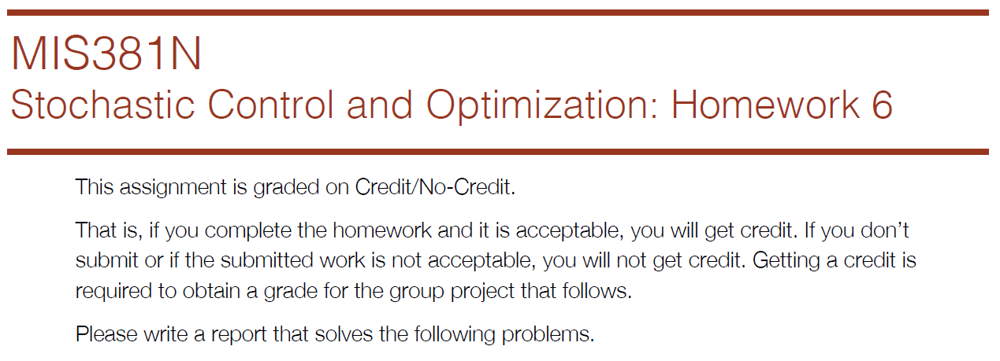
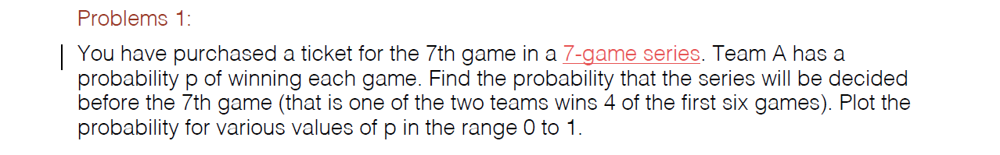
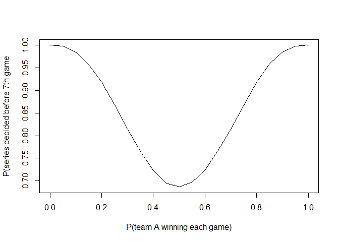
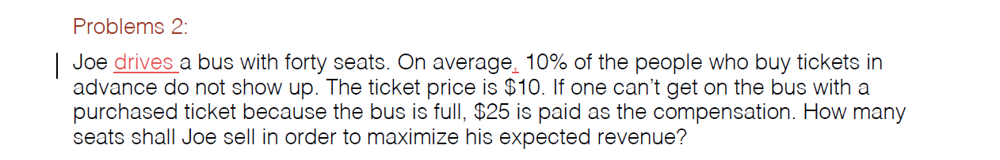
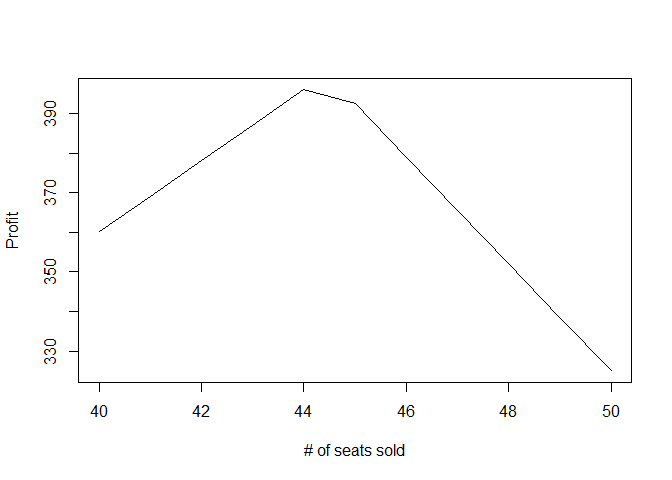
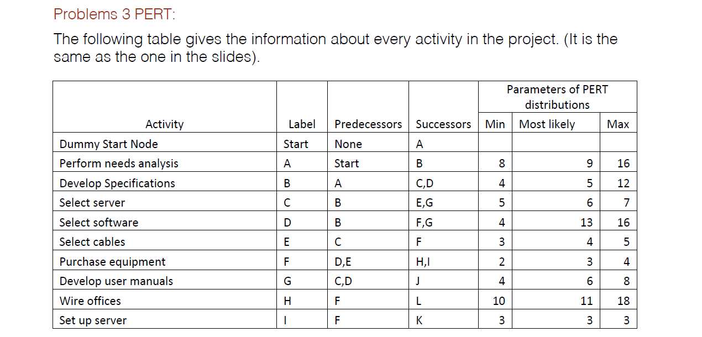
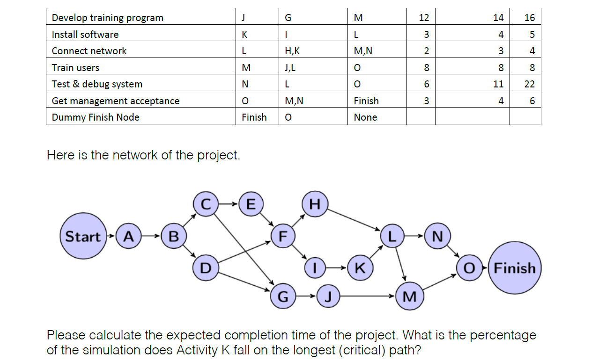
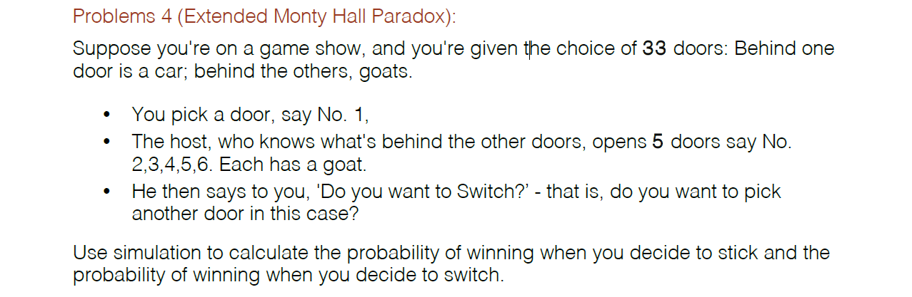
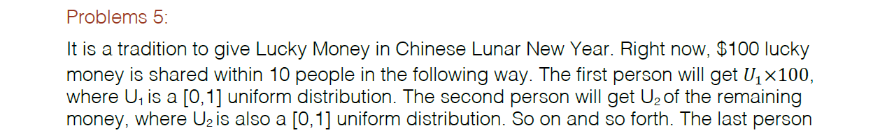

# Homework 6

  



```r
p_win = seq(0, 1, 0.05)
p_win_before_7 = c()
for (i in p_win) {
  sim = rbinom(100000,6,i)
  p_win_before_7 = c(p_win_before_7, mean(sim >= 4 | sim <= 2))
}
p_win_before_7
```

```
##  [1] 1.00000 0.99789 0.98491 0.95796 0.91897 0.86797 0.81505 0.76508
##  [9] 0.72382 0.69460 0.68641 0.69683 0.72394 0.76575 0.81359 0.86818
## [17] 0.91757 0.95960 0.98527 0.99794 1.00000
```

```r
plot(p_win, p_win_before_7, type="l", xlab="P(team A winning each game)", ylab="P(series decided before 7th game")
```


  

  
Joe should sell 44 seats because it generates the highest expected revenue.

```r
n = seq(40, 50, 1)
p = c()
for (i in n) {
  num_show = mean(rbinom(100000,i,0.9))
  revenue = num_show * 10
  num_over = num_show - 40
  if (num_over > 0) {
    cost = num_over * 25
    profit = revenue - cost
  } else {
    profit = revenue
  }
  p = c(p,profit)
}
plot(n, p, type="l", xlab="# of seats sold", ylab="Profit")
```



```r
max(p)
```

```
## [1] 395.9631
```

```r
n[which.max(p)]
```

```
## [1] 44
```
  


  
With 10,000 simulations, the expected completion time is 62.9. K falls on the longest path 0% of the time and L falls on the longest path 81% of the time.

```r
library(triangle)
library(lpSolveAPI)

time = c()
num_k = 0
num_l = 0

for (i in (1:10000)) {
  l = matrix(0,16,16)
  l[1,2] = rltriangle(a=8, b=16, c=9) #A
  l[2,3] = l[2,4] = rltriangle(a=4, b=12, c=5) #B
  l[3,5] = l[3,7] = rltriangle(a=5, b=7, c=6) #C
  l[4,6] = l[4,7] = rltriangle(a=4, b=16, c=13) #D
  l[5,6] = rltriangle(a=3, b=5, c=4) #E
  l[6,8] = l[6,9] = rltriangle(a=2, b=4, c=3) #F
  l[7,10] = rltriangle(a=4, b=8, c=6) #G
  l[8,12] = rltriangle(a=10, b=18, c=11) #H
  l[9,11] = rltriangle(a=3, b=3, c=3) #I
  l[10,13] = rltriangle(a=12, b=16, c=14) #J
  l[11,12] = rltriangle(a=3, b=5, c=4) #K
  l[12,14] = l[12,13] = rltriangle(a=2, b=4, c=3) #L
  l[13,15] = rltriangle(a=8, b=8, c=8) #M
  l[14,15] = rltriangle(a=6, b=22, c=11) #N
  l[15,16] = rltriangle(a=3, b=6, c=4) #O
  
  lanProj <- make.lp(0,16*16)
  
  #set objective coefficients
  set.objfn(lanProj, as.vector(t(l)))
  
  #set objective direction
  lp.control(lanProj,sense='max')
  
  nodes = c(1:16)
  
  rhs = c(1,rep(0,14),-1)
  for (n in 1:16){
    coef = c(l[n,1:16]/l[n,1:16],-l[1:16,n]/l[1:16,n])
    ind = c((n-1)*16+c(1:16),(c(1:16)-1)*16+n)
    nz = is.finite(coef)
    add.constraint(lanProj,coef[nz], "=",rhs[n],ind[nz])               
  }
  
  ColNames = c()
  RowNames = c()
  for(i in 1:16){
    for(j in 1:16){
      ColNames = cbind(ColNames,paste("x",i,",",j, sep=""))
    }
    RowNames=cbind(RowNames,paste("node",i))
  }
  
  dimnames(lanProj) <- list(RowNames, ColNames)
  set.type(lanProj, c(1:256), "binary")
  
  #write to text file
  write.lp(lanProj,'lanProj.lp',type='lp')
  
  
  #solve the model, if this return 0 an optimal solution is found
  status = solve(lanProj)
  
  #this return the proposed solution
  time = c(time, get.objective(lanProj))
  x = get.variables(lanProj)
  if (sum(matrix(x,16,16)[,11]) > 0) {
    num_k = num_k + 1
  }
  if (sum(matrix(x,16,16)[,12]) > 0) {
    num_l = num_l + 1
  }
}

mean(time)
```

```
## [1] 62.88265
```

```r
num_k/10000
```

```
## [1] 0
```

```r
num_l/10000
```

```
## [1] 0.8176
```
  

The probabilities are shown below under switch_wins/10000 and no_switch_wins/10000.

```r
car=c()
pick=c()
swit=c()
switch_wins = 0
no_switch_wins = 0
t<-proc.time()
for (s in 1:10000){
  car[s]=sample(33,1)
  pick[s]=sample(33,1)
  
  x=setdiff(c(1:33),union(pick[s],car[s]))
  host=x[sample(length(x),5)]
  
  no_switch_wins = no_switch_wins + (car[s] == pick[s])
  
  swit[s]=sample(setdiff(c(1:33),union(pick[s],host)),1)
  switch_wins = switch_wins + (car[s] == swit[s])
}
switch_wins/10000
```

```
## [1] 0.0357
```

```r
no_switch_wins/10000
```

```
## [1] 0.0302
```
  


  
The probabilities are shown under max/10000.

```r
max = rep(0,10)
for (i in (1:10000)) {
  remaining = 100
  allocations = c()
  p <- c(runif(9),1)
  for (j in p) {
    x = remaining * j
    allocations = c(allocations, x)
    remaining = remaining - x
  }
  max[which.max(allocations)] = max[which.max(allocations)] + 1
}
max/10000
```

```
##  [1] 0.6183 0.2569 0.0834 0.0306 0.0079 0.0021 0.0005 0.0003 0.0000 0.0000
```
