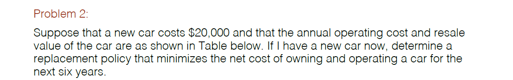

# Homework 7

  

  
The shortest path from node 1 to 10 is 1 > 4 > 8 > 10.  
The shortest path from node 2 to 10 is 2 > 4 > 8 > 10.  

State: t=C1, C2, C3; s=Starting node 1-10  
Actions: Ending node 1-10  
Bellman Equation: min(X[si, j] + V(j, t+1))  
Where X is a 10x10 matrix of cost from the node indicated by the row to the row indicated by the column with high costs where no connections exist. J loops through values 1-10.
  


  
The replacement policy that minimizes the net cost of owning and operating a car for the next six years is to sell in year 2, year 4, and year 6.
  
State: t=Y1, Y2, Y3, Y4, Y5, Y6; s=age of car 1-6  
Actions: Keep or sell  
Bellman Equation: min(cost[si+1] + V[si+1,ti+1], 20000 + 600 + resale[si] + V[1,ti+1])  

```r
T = 6

cost = c(600,1000,1600,2400,3200,4400)
resale = c(-14000,-12000,-8000,-6000,-4000,-2000)
newcar = 20000
tValues = seq(1,T)

sN = length(cost)
tN = length(tValues)

V = matrix(NA,sN,tN)
U = matrix(NA,sN,tN)

for (ti in seq(tN,1,-1)){
  for (si in 1:ti){
    
    if(ti==tN){
      V[si,ti] = resale[si]
      U[si,ti] = 2
    }
    else{    
      keep = cost[si+1] + V[si+1,ti+1]
      sell = 20000 + 600 + resale[si] + V[1,ti+1]
      
      V[si,ti] = min(keep, sell)
      U[si,ti] = which.min(c(keep, sell))
    }  
  } #for si
} #for ti
```
  

  
The sales rep should spend the first three days and nights of the week in Bloomington and then fly to Indianapolis to maximize his sales income less travel costs.
  
States: t=D1, D2, D3, D4, s=Departing from Indianapolis, Bloomington, Chicago  
Actions: Spend day in Indianapolis, Bloomington, Chicago  
Bellman Equation:  
I = sales[1] - cost[1,si] + V[1,ti+1]  
B = sales[2] - cost[2,si] + V[2,ti+1]  
C = sales[3] - cost[3,si] + V[3,ti+1]  
V[si,ti] = max(I,B,C)

```r
T = 4

cost=matrix(c(0,50,20,50,0,70,20,70,0),3,3)
sales = c(120,160,170)
tValues = seq(1,T)

sN = nrow(cost)
tN = length(tValues)

V = matrix(NA,sN,tN)
U = matrix(NA,sN,tN)

for (ti in seq(tN,1,-1)){
  for (si in 1:sN){
    
    if(ti==tN){
      V[si,ti] = sales[1] - cost[si,1]
      U[si,ti] = 1
    }
    else{    
      I = sales[1] - cost[1,si] + V[1,ti+1]
      B = sales[2] - cost[2,si] + V[2,ti+1]
      C = sales[3] - cost[3,si] + V[3,ti+1]
      
      V[si,ti] = max(I,B,C)
      U[si,ti] = which.max(c(I,B,C))
    }  
  } #for si
} #for ti
```
  


  
The investment strategy to maximize NPV is 4k in investment 1, 1k in investment 2, and 1k in investment 3.
  
States: t=I1, I2, I3, s=Amount remaining to invest 0-6  
Actions: Amount to invest 0-6  
Bellman Equation:  
V[s,t=2] = maxd2{r2(d2) + V[s-d2, t+1=3]}  
V[s,t=1] = maxd1{r1(d1) + V[s-d1, t+1=2]}

```r
M=6
T=3

sValues = seq(0,M)
tValues = seq(1,T)

sN=length(sValues)
tN=length(tValues)

V=matrix(NA,sN,tN)
U=matrix(NA,sN,tN)


for (ti in seq(tN,1,-1)){
  for (si in (1:(M+1))){
    if(ti==tN){
      if(si==1){
        V[si,ti]=0
        U[si,ti]=0
      }
      else{
        V[si,ti]=4*(si-1)+5
        U[si,ti]=si-1
      }
    }
    else{
      if (si==1){
        X = 0
        valueChoices=0
      }
      else {
        X = seq(1,si-1)
        if (ti==2){
          valueChoices=c(0,3*X+7)
        } else if (ti==1){
          valueChoices=c(0,7*X+2)
        }
        X = c(0,X)
      }
      maxInv=V[abs(si-X),ti+1]
      maxChoice=max(valueChoices+maxInv)
      
      V[si,ti]=maxChoice
      U[si,ti]=X[which.max(valueChoices+maxInv)]
    }
  }
}
```
  

  
The optimal production schedule is to produce 200 the first month and 600 the second month.
  
States: t=M1, M2, M3, s=Amount of carryover 0-800  
Actions: Cost of production  
Bellman Equation: min(100\*(produce+sValues) + 2500 + 15*sValues[si] + V[,ti+1])  

```r
T=3

sValues = seq(0,800,100)
tValues = seq(1,T)

sN=length(sValues)
tN=length(tValues)

V=matrix(NA,sN,tN)
U=matrix(NA,sN,tN)


for (ti in seq(tN,1,-1)){
  for (si in (1:sN)){
    if(ti==tN){
      if(si==1){
        V[si,ti]=(300-sValues[si])*120+2500
        U[si,ti]=300-sValues[si]
      }
      else{
        demand=300
        carryover=sValues[si]
        produce=demand-carryover
        if (produce<=0){
          V[si,ti]=carryover*15
          U[si,ti]=0
        }
        else{
          V[si,ti]=(demand-carryover)*120+2500+carryover*15
          U[si,ti]=demand-carryover
        }
      }
    }
    else{
      if (ti==2){
        demand=300
        produce=demand-sValues[si]
        if (produce<0){
          produce=0
        }
        costvec=100*(produce+sValues[1:4]) + 2500 + 15*sValues[si] + V[,ti+1][1:4]
        V[si,ti]=min(costvec)
        U[si,ti]=produce+sValues[1:4][which.min(costvec)]
      }
      else{
        demand=200
        produce=demand
        costvec=100*(produce+sValues[1:7]) + 2500 + 15*sValues[si] + V[,ti+1][1:7]
        V[si,ti]=min(costvec)
        U[si,ti]=produce+sValues[1:7][which.min(costvec)]
      }
    }
  }
}
```
