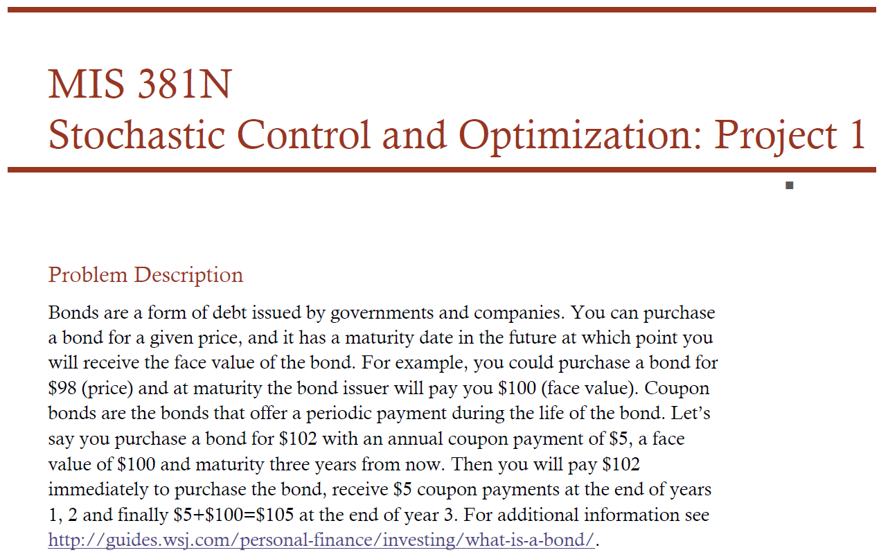
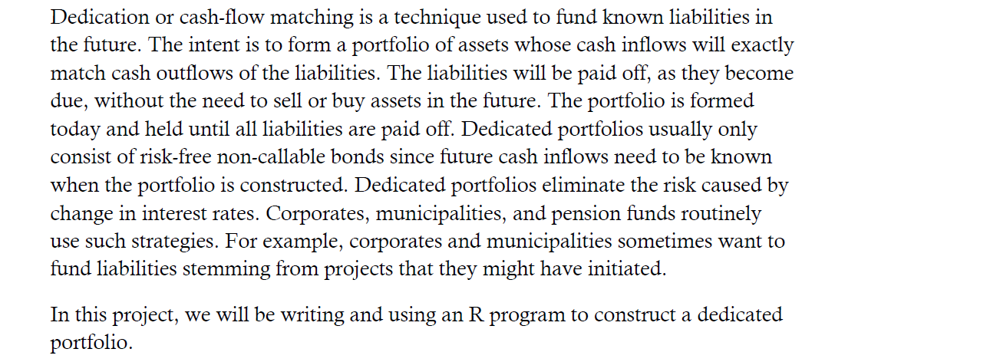
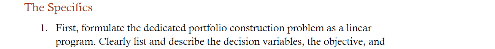
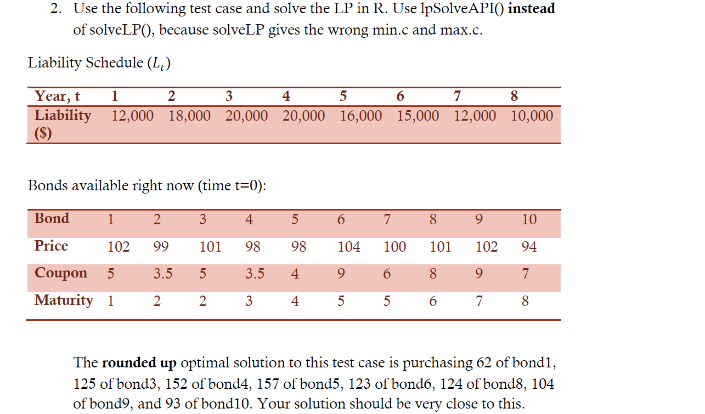
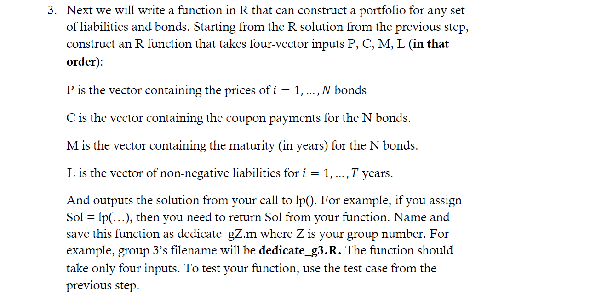
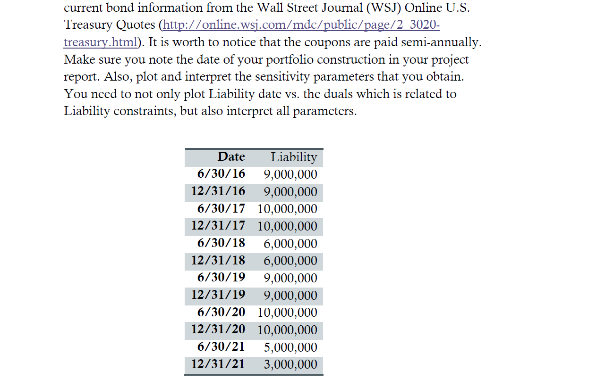

**Decision variables:**  
(x1), ... , (x10) amount of each bond  
(z1), ... , (z7) excess cash at the end of each year (excluding the excess cash at the last period)  

**Minimize:** 102(x1) + 99(x2) + 101(x3) + 98(x4) + 98(x5) + 104(x6) + 100(x7) + 101(x8) + 102(x9) + 94(x10)
 cost of each bond

**Subject to:**  
 year 1: 12000 = 100(x1) + 5(x1) + 3.5(x2) + 5(x3) + 3.5(x4) + 4(x5) + 9(x6) + 6(x7) + 8(x8) + 9(x9) + 7(x10) - (z1)  
 year 2: ...  

**Variables** = bond terms (10), excess cash (7)
  
**Constraints** = years (8)  
  

```{r}
library(lpSolveAPI)
# setting parameters for example portfolio
p = c(102,99,101,98,98,104,100,101,102,94) # price
c = c(5,3.5,5,3.5,4,9,6,8,9,7) # coupon
m = c(1,2,2,3,4,5,5,6,7,8) # maturity
l = c(12000,18000,20000,20000,16000,15000,12000,10000) # liabilities (RHS)
```

```{r}
num.constraints = length(l) # set num of constraints to length of liabilities
num.bonds = length(c) # set num of bonds to length of coupons

my.lp = make.lp(num.constraints, num.bonds+num.constraints-1) # constraints, variables
check = matrix(0, num.constraints, num.bonds+num.constraints-1) # matrix to check that values are correctly inputted

z.mat = diag(-1, num.constraints, num.constraints-1) # initialize z mat and assign -1 to current year excess cash
z.mat[col(z.mat) == row(z.mat)-1] = 1 # assign 1 to previous year excess cash
z = 1
for(i in (num.bonds+1):(num.bonds+num.constraints-1)) { # loop to add z's to columns
  set.column(my.lp, i, z.mat[,z])
  check[,i] = z.mat[,z]
  z = z + 1
}

for(bond in (1:num.bonds)){ # loop to add columns for x variables
  maturity = m[bond] # set maturity to year the bond matures
  col = rep(0, num.constraints) # assign all variables 0's
  col[1:maturity] = c[bond] # assign coupons for all eligible years
  col[maturity] = (100 + c[bond]) # assign 100 + coupon value at maturity
  set.column(my.lp, bond, col) # set column
  check[, bond] = col
}

set.objfn(my.lp, c(p, rep(0, num.constraints-1)))
set.constr.type(my.lp, rep("=", num.constraints))
set.rhs(my.lp, l)

solve(my.lp)
```
  
The matrix below tells us how much and of each bond the portfolio should consist of.
```{r}
get.variables(my.lp) # get optimal variables
```
  

```{r}
dedicate_g1 = function (p,c,m,l) { # function that takes in bond portfolio parameters and returns a .lp object
  num.constraints = length(l) # set num of constraints to length of liabilities
  num.bonds = length(c) # set num of bonds to length of coupons
  
  my.lp = make.lp(num.constraints, num.bonds+num.constraints-1) # constraints, variables
  check = matrix(0, num.constraints, num.bonds+num.constraints-1) # matrix to check that values are correctly inputted
  
  z.mat = diag(-1, num.constraints, num.constraints-1) # initialize z mat and assign -1 to current year excess cash
  z.mat[col(z.mat) == row(z.mat)-1] = 1 # assign 1 to previous year excess cash
  z = 1
  for(i in (num.bonds+1):(num.bonds+num.constraints-1)) { # loop to add z's to columns
    set.column(my.lp, i, z.mat[,z])
    check[,i] = z.mat[,z]
    z = z + 1
  }
  
  for(bond in (1:num.bonds)){ # loop to add columns for x variables
    maturity = m[bond] # set maturity to year the bond matures
    col = rep(0, num.constraints) # assign all variables 0's
    col[1:maturity] = c[bond] # assign coupons for all eligible years
    col[maturity] = (100 + c[bond]) # assign 100 + coupon value at maturity
    set.column(my.lp, bond, col) # set column
    check[, bond] = col
  }
  
  set.objfn(my.lp, c(p, rep(0, num.constraints-1)))
  set.constr.type(my.lp, rep("=", num.constraints))
  set.rhs(my.lp, l)
  return(my.lp)
}
```

```{r}
# testing function on example portfolio
old_port = dedicate_g1(p,c,m,l)
solve(old_port)
```

```{r}
get.variables(old_port) # looks right
```

```{r}
get.objective(old_port) # looks right
```
  

  
```{r}
bonds = read.csv('bonds.csv', header=TRUE) # csv containing maturity date, coupon, and ask price provided on the website

bonds$Matur_Date = as.Date(as.character(bonds$Maturity),format="%m/%d/%Y")

bonds = bonds[bonds$Matur_Date <= as.Date('12/31/2021',format="%m/%d/%Y"),] # remove all bonds maturing after last liability date

liability_dates = c('6/30/2016','12/31/2016','6/30/2017','12/31/2017','6/30/2018','12/31/2018','6/30/2019',
                    '12/31/2019','6/30/2020','12/31/2020','6/30/2021','12/31/2021') # create a list of liability dates
liability_dates = as.Date(liability_dates,format="%m/%d/%Y")

m = 0 # assign maturity periods using the date lists; goal is to have list of maturity due periods (numbering 1-12), similar to format given in example portfolio
for (i in 1:length(bonds$Matur_Date)) {
  for (j in 1:length(liability_dates)) {
    if (bonds$Matur_Date[i] <= liability_dates[j]) {
      m[i] = j
      break
    }
  }
}

# use function to optimize new portfolio
p = bonds$Asked #price
c = bonds$Coupon #coupon
l = c(9000000,9000000,10000000,10000000,6000000,6000000,9000000,9000000,10000000,10000000,5000000,3000000) #liabilities (RHS)

new_port = dedicate_g1(p,c,m,l)
solve(new_port)
```

The matrix below specifies how much of each bond the portfolio should consist of. The last 11 variables are the z variables which represent excess cash carried over each year. They indicate that approximately $4.7M should be carried over from period 10 to 11.
```{r}
get.variables(new_port)
```

The cost of the portfolio is $74,042,228, which equates to $21,957,772 in savings (ignoring interest/time value of money).
```{r}
get.objective(new_port)
```
  
Finally, we plot and interpret the sensitivity parameters of the dedicated portfolio.
```{r}
# plotting bond and liability duals versus libability period (analagous to date)
duals = get.dual.solution(new_port)
sensitivity = get.sensitivity.rhs(new_port)
dual_df = data.frame(sensitivity$duals,sensitivity$dualsfrom,sensitivity$dualstill)

liab_duals = dual_df[1:12,]
bond_duals = dual_df[13:236,]
```

```{r}
plot(m, bond_duals$sensitivity.duals, main="Bond Duals by Maturity Period")
```

The graph above shows the shadow prices for each of the 224 bonds by maturity period. The shadow price represents the increase in the objective value (cost of the portfolio) from a purchase of an additional bond. We see a positive relationship between maturity period and the duals, such that buying additional bonds with later maturity dates has a greater impact on the total portfolio cost than buying bonds with shorter term maturities.

This makes sense, because the further into the future a bond matures, the more coupons it will generate and the more expensive it is. For example, bond #1 has a maturity of 2/15/2016 and a shadow price of 8.05. This means buying an additional unit of bond 1 would increase the objective value by 8.05. Buying an additional bond that matures in a later period would increase the objective value by a greater amount.
```{r}
plot(c(1:12), liab_duals$sensitivity.duals, main="Liability Duals by Maturity Period")
```

Looking at liability duals by maturity shows a negative relationship. The first liability has a shadow price of 0.92, which means that an increase in the first liability by $1 requires a $0.92 increase in the objective value, or cost of the portfolio. Shadow prices fall as maturity dates rise because there is more time to accumulate return to cover the liability.