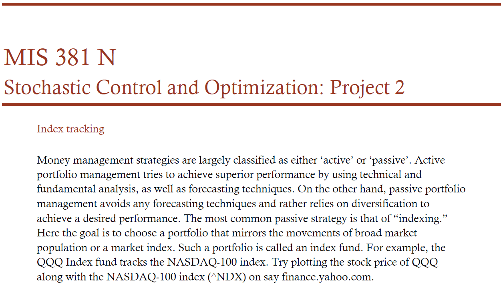
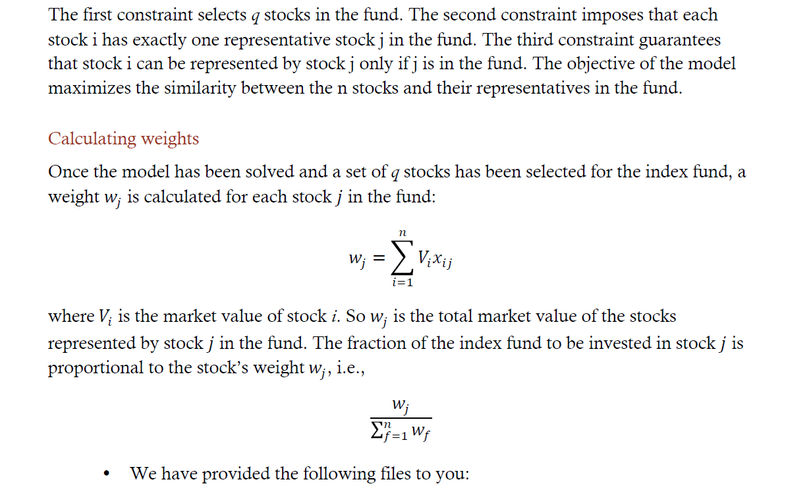
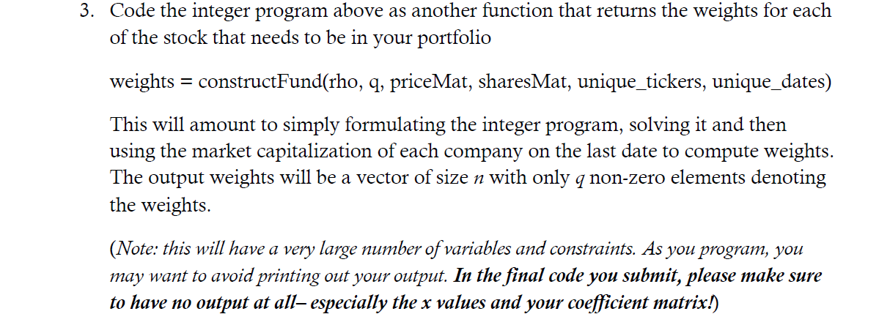

# Index Tracking with Integer Programming







```r
rm(list = ls())
library(lpSolve)
library(reshape)
library(magic)
```

```
## Loading required package: abind
```

```
## Warning: package 'abind' was built under R version 3.2.5
```

```r
data = read.csv("N100StkPrices.csv", header=TRUE)

# cleaning up data
data = na.omit(data)
ticker = data$TICKER

# spun off MDLZ
delete = seq(1, dim(data)[1])[ticker == "MDLZ"]
data = data[-delete, ]

date = apply(as.matrix(data$date), MARGIN=1, FUN="toString")
date = as.Date(date, "%Y%m%d")
ticker = data$TICKER
price = data$PRC
shares = data$SHROUT

# accounting for changes in ticker names
# KFT changed to KRFT in Oct 2012.
ticker[ticker == "KFT"] = "KRFT"

# SXCI changed to CTRX in Jul 2012.
ticker[ticker == "SXCI"] = "CTRX"

# HANS changed to MNST in Jan 2012.
ticker[ticker == "HANS"] = "MNST"

# convert prices to a matrix, arranged by rows of dates and columns of tickers
unique_dates = sort(unique((date)))
unique_tickers = sort(unique(ticker))

priceMat = matrix(NA, length(unique_dates), length(unique_tickers))
sharesMat = matrix(0, length(unique_dates), length(unique_tickers))

for (i in 1:length(unique_tickers)) { # loop to create price and shares matrices
  tic = unique_tickers[i]
  idx = is.element(unique_dates, date[ticker==tic])
  
  priceMat[idx, i] = price[ticker==tic]
  sharesMat[idx, i] = shares[ticker==tic]
}

rownames(priceMat) = as.character(unique_dates)
rownames(sharesMat) = as.character(unique_dates)

rm(list = c("data", "delete", "i", "idx", "price", "shares", "tic", "ticker", "date"))

# calculate return matrix
returnMat = matrix(NA, length(unique_dates)-1, length(unique_tickers)) # initialize matrix for daily returns

for (i in 1:length(unique_tickers)) { # loop through each unique ticker symbol
  prices = priceMat[, i] # get the prices for that symbol
  daily_returns = diff(prices)/prices[-length(prices)] # calculate the return
  return_dates = unique_dates[2:length(unique_dates)] # remove the first date which we cannot calculate return for
  returnMat[, i] = daily_returns # update return matrix
}

rownames(returnMat) = as.character(return_dates) # set rownames as return dates
colnames(returnMat) = unique_tickers # set colnames as tickers
```
  


```r
corrMat = cor(returnMat, use="pairwise.complete.obs") # calculate correlation matrix, rho
```
  


```r
tickers = unique_tickers[1:10]

tiny_corrMat = corrMat[1:10, 1:10]
tiny_corrMat_melt = melt(tiny_corrMat, id = c('X2', 'X1'))
head(tiny_corrMat_melt)
```

```
##     X1   X2     value
## 1 AAPL AAPL 1.0000000
## 2 ADBE AAPL 0.2851738
## 3  ADI AAPL 0.3265191
## 4  ADP AAPL 0.3418359
## 5 ADSK AAPL 0.2816883
## 6 AKAM AAPL 0.2679535
```

```r
tiny_priceMat = priceMat[1:10, 1:10]
tiny_sharesMat = sharesMat[1:10, 1:10]

constructFund <- function(rho, q, sharesMat, priceMat, unique_tickers, unique_dates) {
  n = length(unique_tickers)
  reshaped_rho = melt(rho, id = c('unique_tickers', 'unique_tickers')) # reshape similar matrix into vector
  C = c(reshaped_rho$value, rep(0, n))
  A1 = c(rep(0, n*n), rep(1, n)) # constraint 1, only 1 constraint
  A2x = matrix(0, n, n*n)
  for (j in 1:n) {
    A2x[j, (n*(j-1)+1):(n*j)] = 1
  }
  A2y = matrix(0, n, n)
  A2 = cbind(A2x, A2y) # constraint 2, 100 constraints
  A3x = diag(1, n*n)
  A3y1 = diag(-1, n)
  A3y = NULL
  for (j in 1:n) {
    A3y = rbind(A3y, A3y1)
  }
  A3 = cbind(A3x, A3y) # constraint 3, 10000 constraints
  A = rbind(A1, A2, A3)
  b = c(q, rep(1, n), rep(0, n*n))
  dir = c(rep('=', n+1), rep('<=', n*n))
  s = lp("max", C, A, dir, b, all.bin=TRUE)
  solutionMat = matrix(s$solution, n, n, byrow = TRUE)
  
  price = priceMat[dim(priceMat)[1], ]
  shares = sharesMat[dim(sharesMat)[1], ]
  value = price * shares
  weights = NULL
  for (j in 1:n) {
    weights = c(weights, sum(solutionMat[, j] * value))
  }
  sum_weights = sum(weights)
  real_weights = weights / sum_weights
  return (real_weights)
}

# a small test on a 10 by 10 matrix, with 5 stocks to form an index
test_solution = constructFund(tiny_corrMat, 5, tiny_priceMat, tiny_sharesMat, tickers, unique_dates)
test_solution # looks good
```

```
##  [1] 0.71055453 0.00000000 0.15636129 0.00000000 0.00000000 0.01023406
##  [7] 0.00000000 0.02567000 0.00000000 0.09718011
```
  


```r
weights = constructFund(corrMat, 25, priceMat, sharesMat, unique_tickers, unique_dates)

# prep monthly data
mdata = read.csv("N100Monthly.csv", header=TRUE, stringsAsFactors=FALSE)

mdate = apply(as.matrix(mdata$date), MARGIN = 1, FUN = "toString")
mdate = as.Date(mdate, "%Y%m%d")

mticker = mdata$TICKER
mprice = mdata$PRC
mshares = mdata$SHROUT
mticker[mticker == "FOXA"] = "NWSA"

unique_mdates = sort(unique((mdate)))
unique_mtickers = sort(unique(mticker))

idx = is.element(unique_mtickers, unique_tickers)

monthlyPriceMat = matrix(NA, length(unique_mdates), length(unique_tickers))

for (i in 1:length(unique_tickers)) {
  tic = unique_tickers[i]
  idx = is.element(unique_mdates, mdate[mticker == tic])
  monthlyPriceMat[idx, i] = mprice[mticker == tic]
}

monthlyPriceMat = rbind(priceMat[250,], monthlyPriceMat)

# calculate monthly return
returnMonthlyMat = matrix(NA, length(unique_mdates), length(unique_tickers)) #initialize matrix for daily returns

for (i in 1:length(unique_tickers)) {
  prices = monthlyPriceMat[, i]
  monthly_returns = diff(prices)
  returnMonthlyMat[, i] = monthly_returns
}

# calculate our index's return
total_investment = 1000000

investment_vector = weights * total_investment
share_vector = investment_vector / priceMat[250,]
total_value = share_vector * monthlyPriceMat[1,]

real_return = NULL
for (i in 1:dim(returnMonthlyMat)[1]) {
  r = sum(share_vector * returnMonthlyMat[i,])
  real_return = c(real_return, r)
}
real_return
```

```
##  [1]  47643.91  17226.31  53388.44  11838.84  28488.67 -22496.78  60733.68
##  [8] -35419.86  47948.64  48706.61  52942.94  46589.89
```

```r
# calculate nasdaq return
nasdaq_2013 = c(2660.93, 2731.53, 2738.58, 2818.69, 2887.44, 2981.76, 2909.60, 3090.19, 3073.81, 3218.20, 3377.73, 3487.82, 3592.00)
num_share_nasdaq = total_investment / nasdaq_2013[1]
nasdaq_monthly_return = NULL
for (i in 1:length(nasdaq_2013)) {
  monthly_return = nasdaq_2013[i+1] - nasdaq_2013[i]
  nasdaq_monthly_return = c(nasdaq_monthly_return, monthly_return)
}

nasdaq_return = nasdaq_monthly_return[1:12] * num_share_nasdaq
```
The plot below shows that our index fund tracks the return of the nasdaq fairly closely.

```r
# plot the two returns
par(mfrow=c(1, 1))
plot(nasdaq_return, type='b', xlab='Month', ylab='Return', col='red')
lines(real_return, type='b', col='blue')
legend('topleft',legend=c('nasdaq', 'our fund'), col=c('red', 'blue'), lty=c(1, 1))
```


  

  
We will use age of the company as our similarity measure. To do this, we subtracted the current year, 2016, from the year the company was established and calculated a correlation matrix between the ages.

```r
ageMat = read.csv("age_corr_mat.csv", header=TRUE)
corrMat[1:5, 1:5]
```

```
##           AAPL      ADBE       ADI       ADP      ADSK
## AAPL 1.0000000 0.2851738 0.3265191 0.3418359 0.2816883
## ADBE 0.2851738 1.0000000 0.5660888 0.5495794 0.6250335
## ADI  0.3265191 0.5660888 1.0000000 0.6220763 0.5816736
## ADP  0.3418359 0.5495794 0.6220763 1.0000000 0.4948663
## ADSK 0.2816883 0.6250335 0.5816736 0.4948663 1.0000000
```

```r
ageMat[1:5, 1:5]
```

```
##      X      AAPL      ADBE       ADI       ADP
## 1 AAPL 1.0000000 0.9487179 0.9059829 0.7692308
## 2 ADBE 0.9487179 1.0000000 0.8547009 0.7179487
## 3  ADI 0.9059829 0.8547009 1.0000000 0.8632479
## 4  ADP 0.7692308 0.7179487 0.8632479 1.0000000
## 5 ADSK 0.9487179 1.0000000 0.8547009 0.7179487
```

```r
weights = constructFund(as.matrix(ageMat), 25, priceMat, sharesMat, unique_tickers, unique_dates)

investment_vector = weights * total_investment
share_vector = investment_vector / priceMat[250,]
total_value = share_vector * monthlyPriceMat[1,]

real_return = NULL
for (i in 1:dim(returnMonthlyMat)[1]) {
  r = sum(share_vector * returnMonthlyMat[i,])
  real_return = c(real_return, r)
}
real_return
```

```
##  [1] 66101.6345  6485.3268 44646.8029 28042.9865 54386.6220  -857.7841
##  [7] 76313.7007 -9998.6301 76928.6807 25472.9363 30395.5055 54572.8182
```
Our similarity measure performed surprisingly well. The age fund also tracks the nasdaq pretty closely.

```r
plot(nasdaq_return, type='b', xlab='Month', ylab='Return', col='red')
lines(real_return, type='b', col='blue')
legend('topleft',legend=c('nasdaq', 'age fund'), col=c('red', 'blue'), lty=c(1, 1))
```


  

