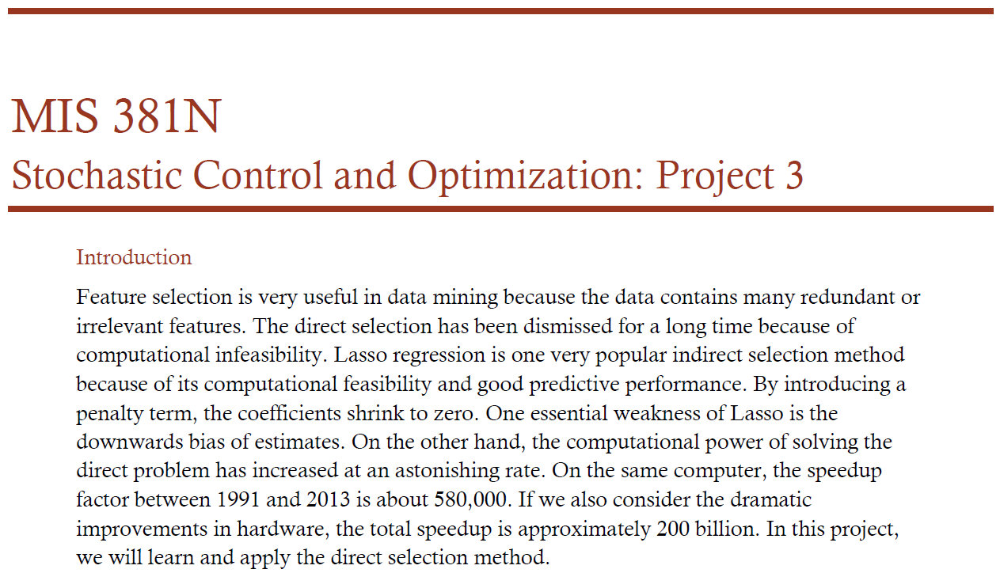
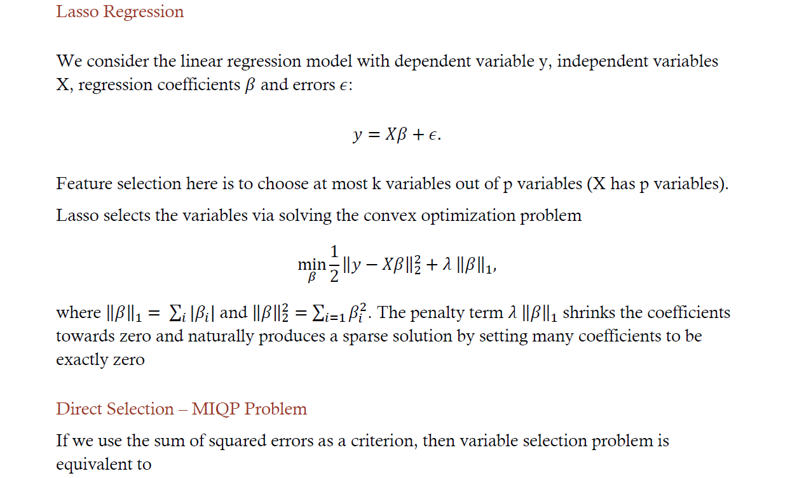
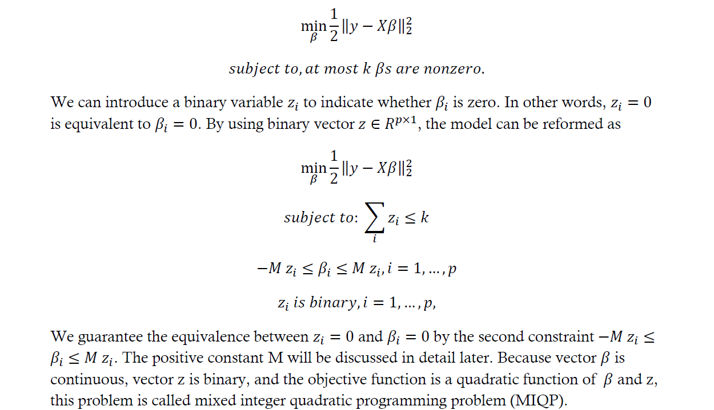
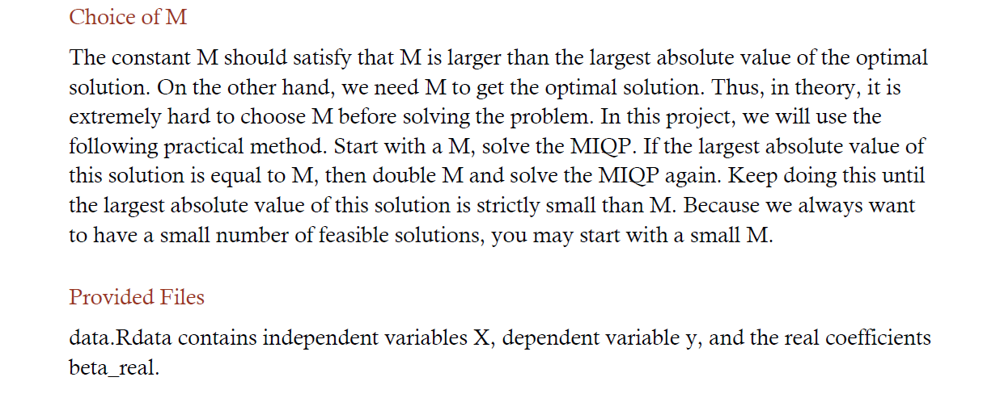
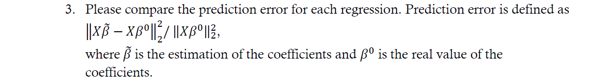

# Variable Selection with Nonlinear programming







Running Lasso with cross validation on the data, we find the best lambda which is show under best_lasso. This yields a model with 9 non-zero coefficients.

```r
library(glmnet)
```

```
## Loading required package: Matrix
```

```
## Loading required package: foreach
```

```
## Loaded glmnet 2.0-2
```

```r
load('data.rdata')
cvfit = cv.glmnet(x = X, y = y)
best_lasso = glmnet(X, y, family="gaussian", alpha=1, lambda=c(cvfit$lambda.min))
best_lasso
```

```
## 
## Call:  glmnet(x = X, y = y, family = "gaussian", alpha = 1, lambda = c(cvfit$lambda.min)) 
## 
##      Df   %Dev  Lambda
## [1,] 25 0.8735 0.04732
```

```r
coef(cvfit,lambda=best_lam$lambda)
```

```
## 65 x 1 sparse Matrix of class "dgCMatrix"
##                       1
## (Intercept) -0.03771868
## V1           0.78470829
## V2           .         
## V3           .         
## V4           .         
## V5           .         
## V6           .         
## V7           .         
## V8           .         
## V9           0.95209206
## V10          .         
## V11          .         
## V12          .         
## V13          .         
## V14          .         
## V15          .         
## V16          .         
## V17          0.85686334
## V18          .         
## V19          .         
## V20          .         
## V21          .         
## V22          .         
## V23          .         
## V24          0.01852537
## V25          0.99677258
## V26          .         
## V27          .         
## V28          .         
## V29          .         
## V30          .         
## V31          .         
## V32          .         
## V33          0.84460707
## V34          .         
## V35          .         
## V36          .         
## V37          .         
## V38          .         
## V39          .         
## V40          .         
## V41          0.87347516
## V42          .         
## V43          .         
## V44          .         
## V45          .         
## V46          .         
## V47          .         
## V48          .         
## V49          0.91864849
## V50          .         
## V51          .         
## V52          .         
## V53          .         
## V54          .         
## V55          .         
## V56          .         
## V57          0.92057756
## V58          .         
## V59          .         
## V60          .         
## V61          .         
## V62          .         
## V63          .         
## V64          .
```

Next, we use mixed-integer quadratic programming for variable selection with minimizing sum of squared errors as the criterion. The problem is formulated below.

**Decision variables:**  
Beta1, ... , Beta64 coefficient for each X variable  
z1, ... , z64 binary variable to indicate whether Beta is zero

**Minimize:**  
(1/2)||y-X\*Beta||^2^  
OR  
y^2^ - 2\*Beta\*y + (X\*Beta)^2^

**Subject To:**  
-M\*zi - Betai <= 0  
Betai - M\*zi <= 0  
z1 + ... + z64 <= k
                
We run the MIQP with k=8. M starts off at 0.01, doubling to 1.28.

```r
library(slam)
library(gurobi)

param_gen = function(M, k){ # function for forming the constraint matrix
    A_left = rbind(diag(-1, 64, 64), diag(1, 64, 64))
    A_right = rbind(diag(-M, 64, 64), diag(-M, 64, 64))
    A_top = cbind(A_left, A_right)
    k_constr = c(rep(0, 64), rep(1, 64))
    A = rbind(A_top, k_constr)
    rhs = c(rep(0, 128), k)
    return(list("A" = A, 
                "rhs" = rhs))
}

M = 0.01 # set initial value of M
k = 8 # set number of variables to select
zeros_64 = matrix(0, 64, 64) # matrix of 64x64 0's for objective function

model = list()
model$obj = c(-t(X) %*% y, rep(0, 64)) # linear part of the obj
model$Q = rbind(cbind(0.5 * t(X) %*% X, zeros_64), cbind(zeros_64, zeros_64)) # quadratic part of the obj
model$sense = rep("<=", 129)
model$vtype = c(rep("C", 64), rep("B", 64))

beta_try = c(M, rep(0, 127))

while (any(beta_try == M)) { # loop to choose M
    M = 2 * M
    params = param_gen(M, k)
    model$A = params$A
    model$rhs = params$rhs
    MIQP_sol = gurobi(model)
    beta_try = MIQP_sol$x[1:64]
}
```

```
## Warning for adding variables: zero or small (< 1e-13) coefficients, ignored
## Optimize a model with 129 rows, 128 columns and 320 nonzeros
## Model has 2080 quadratic objective terms
## Coefficient statistics:
##   Matrix range    [2e-02, 1e+00]
##   Objective range [3e+00, 6e+02]
##   Bounds range    [1e+00, 1e+00]
##   RHS range       [8e+00, 8e+00]
## Found heuristic solution: objective 0
## Presolve removed 64 rows and 0 columns
## Presolve time: 0.00s
## Presolved: 65 rows, 128 columns, 192 nonzeros
## Presolved model has 2080 quadratic objective terms
## Variable types: 64 continuous, 64 integer (64 binary)
## 
## Root relaxation: objective -8.088823e+01, 133 iterations, 0.00 seconds
## 
##     Nodes    |    Current Node    |     Objective Bounds      |     Work
##  Expl Unexpl |  Obj  Depth IntInf | Incumbent    BestBd   Gap | It/Node Time
## 
## *    0     0               0     -80.8882278  -80.88823  0.00%     -    0s
## 
## Explored 0 nodes (133 simplex iterations) in 0.00 seconds
## Thread count was 4 (of 4 available processors)
## 
## Optimal solution found (tolerance 1.00e-04)
## Best objective -8.088822775103e+01, best bound -8.088822775103e+01, gap 0.0%
## Warning for adding variables: zero or small (< 1e-13) coefficients, ignored
## Optimize a model with 129 rows, 128 columns and 320 nonzeros
## Model has 2080 quadratic objective terms
## Coefficient statistics:
##   Matrix range    [4e-02, 1e+00]
##   Objective range [3e+00, 6e+02]
##   Bounds range    [1e+00, 1e+00]
##   RHS range       [8e+00, 8e+00]
## Found heuristic solution: objective 0
## Presolve removed 64 rows and 0 columns
## Presolve time: 0.00s
## Presolved: 65 rows, 128 columns, 192 nonzeros
## Presolved model has 2080 quadratic objective terms
## Variable types: 64 continuous, 64 integer (64 binary)
## 
## Root relaxation: objective -1.601695e+02, 133 iterations, 0.00 seconds
## 
##     Nodes    |    Current Node    |     Objective Bounds      |     Work
##  Expl Unexpl |  Obj  Depth IntInf | Incumbent    BestBd   Gap | It/Node Time
## 
## *    0     0               0    -160.1694916 -160.16949  0.00%     -    0s
## 
## Explored 0 nodes (133 simplex iterations) in 0.00 seconds
## Thread count was 4 (of 4 available processors)
## 
## Optimal solution found (tolerance 1.00e-04)
## Best objective -1.601694916082e+02, best bound -1.601694916082e+02, gap 0.0%
## Warning for adding variables: zero or small (< 1e-13) coefficients, ignored
## Optimize a model with 129 rows, 128 columns and 320 nonzeros
## Model has 2080 quadratic objective terms
## Coefficient statistics:
##   Matrix range    [8e-02, 1e+00]
##   Objective range [3e+00, 6e+02]
##   Bounds range    [1e+00, 1e+00]
##   RHS range       [8e+00, 8e+00]
## Found heuristic solution: objective 0
## Presolve removed 64 rows and 0 columns
## Presolve time: 0.00s
## Presolved: 65 rows, 128 columns, 192 nonzeros
## Presolved model has 2080 quadratic objective terms
## Variable types: 64 continuous, 64 integer (64 binary)
## 
## Root relaxation: objective -3.139111e+02, 133 iterations, 0.00 seconds
## 
##     Nodes    |    Current Node    |     Objective Bounds      |     Work
##  Expl Unexpl |  Obj  Depth IntInf | Incumbent    BestBd   Gap | It/Node Time
## 
## *    0     0               0    -313.9111276 -313.91113  0.00%     -    0s
## 
## Explored 0 nodes (133 simplex iterations) in 0.00 seconds
## Thread count was 4 (of 4 available processors)
## 
## Optimal solution found (tolerance 1.00e-04)
## Best objective -3.139111276407e+02, best bound -3.139111276407e+02, gap 0.0%
## Warning for adding variables: zero or small (< 1e-13) coefficients, ignored
## Optimize a model with 129 rows, 128 columns and 320 nonzeros
## Model has 2080 quadratic objective terms
## Coefficient statistics:
##   Matrix range    [2e-01, 1e+00]
##   Objective range [3e+00, 6e+02]
##   Bounds range    [1e+00, 1e+00]
##   RHS range       [8e+00, 8e+00]
## Found heuristic solution: objective 0
## Presolve removed 64 rows and 0 columns
## Presolve time: 0.00s
## Presolved: 65 rows, 128 columns, 192 nonzeros
## Presolved model has 2080 quadratic objective terms
## Variable types: 64 continuous, 64 integer (64 binary)
## 
## Root relaxation: objective -6.021108e+02, 133 iterations, 0.00 seconds
## 
##     Nodes    |    Current Node    |     Objective Bounds      |     Work
##  Expl Unexpl |  Obj  Depth IntInf | Incumbent    BestBd   Gap | It/Node Time
## 
## *    0     0               0    -602.1108330 -602.11083  0.00%     -    0s
## 
## Explored 0 nodes (133 simplex iterations) in 0.00 seconds
## Thread count was 4 (of 4 available processors)
## 
## Optimal solution found (tolerance 1.00e-04)
## Best objective -6.021108329791e+02, best bound -6.021108329791e+02, gap 0.0%
## Warning for adding variables: zero or small (< 1e-13) coefficients, ignored
## Optimize a model with 129 rows, 128 columns and 320 nonzeros
## Model has 2080 quadratic objective terms
## Coefficient statistics:
##   Matrix range    [3e-01, 1e+00]
##   Objective range [3e+00, 6e+02]
##   Bounds range    [1e+00, 1e+00]
##   RHS range       [8e+00, 8e+00]
## Found heuristic solution: objective 0
## Presolve removed 64 rows and 0 columns
## Presolve time: 0.00s
## Presolved: 65 rows, 128 columns, 192 nonzeros
## Presolved model has 2080 quadratic objective terms
## Variable types: 64 continuous, 64 integer (64 binary)
## 
## Root relaxation: objective -1.101381e+03, 136 iterations, 0.00 seconds
## 
##     Nodes    |    Current Node    |     Objective Bounds      |     Work
##  Expl Unexpl |  Obj  Depth IntInf | Incumbent    BestBd   Gap | It/Node Time
## 
##      0     0 -1101.3807    0    2    0.00000 -1101.3807      -     -    0s
## H    0     0                    -1101.375977 -1101.3807  0.00%     -    0s
## 
## Explored 0 nodes (136 simplex iterations) in 0.00 seconds
## Thread count was 4 (of 4 available processors)
## 
## Optimal solution found (tolerance 1.00e-04)
## Best objective -1.101375976748e+03, best bound -1.101380741476e+03, gap 0.0004%
## Warning for adding variables: zero or small (< 1e-13) coefficients, ignored
## Optimize a model with 129 rows, 128 columns and 320 nonzeros
## Model has 2080 quadratic objective terms
## Coefficient statistics:
##   Matrix range    [6e-01, 1e+00]
##   Objective range [3e+00, 6e+02]
##   Bounds range    [1e+00, 1e+00]
##   RHS range       [8e+00, 8e+00]
## Found heuristic solution: objective 0
## Presolve removed 64 rows and 0 columns
## Presolve time: 0.00s
## Presolved: 65 rows, 128 columns, 192 nonzeros
## Presolved model has 2080 quadratic objective terms
## Variable types: 64 continuous, 64 integer (64 binary)
## 
## Root relaxation: objective -1.792065e+03, 139 iterations, 0.00 seconds
## 
##     Nodes    |    Current Node    |     Objective Bounds      |     Work
##  Expl Unexpl |  Obj  Depth IntInf | Incumbent    BestBd   Gap | It/Node Time
## 
##      0     0 -1792.0647    0    5    0.00000 -1792.0647      -     -    0s
## H    0     0                    -1791.369197 -1792.0647  0.04%     -    0s
##      0     0     cutoff    0      -1791.3692 -1791.3692  0.00%     -    0s
## 
## Explored 0 nodes (143 simplex iterations) in 0.00 seconds
## Thread count was 4 (of 4 available processors)
## 
## Optimal solution found (tolerance 1.00e-04)
## Best objective -1.791369196658e+03, best bound -1.791369196658e+03, gap 0.0%
## Warning for adding variables: zero or small (< 1e-13) coefficients, ignored
## Optimize a model with 129 rows, 128 columns and 320 nonzeros
## Model has 2080 quadratic objective terms
## Coefficient statistics:
##   Matrix range    [1e+00, 1e+00]
##   Objective range [3e+00, 6e+02]
##   Bounds range    [1e+00, 1e+00]
##   RHS range       [8e+00, 8e+00]
## Found heuristic solution: objective 0
## Presolve removed 64 rows and 0 columns
## Presolve time: 0.00s
## Presolved: 65 rows, 128 columns, 192 nonzeros
## Presolved model has 2080 quadratic objective terms
## Variable types: 64 continuous, 64 integer (64 binary)
## 
## Root relaxation: objective -2.097980e+03, 91 iterations, 0.00 seconds
## 
##     Nodes    |    Current Node    |     Objective Bounds      |     Work
##  Expl Unexpl |  Obj  Depth IntInf | Incumbent    BestBd   Gap | It/Node Time
## 
##      0     0 -2097.9804    0   29    0.00000 -2097.9804      -     -    0s
## H    0     0                    -2084.831517 -2097.9804  0.63%     -    0s
##      0     0     cutoff    0      -2084.8315 -2084.8315  0.00%     -    0s
## 
## Explored 0 nodes (128 simplex iterations) in 0.01 seconds
## Thread count was 4 (of 4 available processors)
## 
## Optimal solution found (tolerance 1.00e-04)
## Best objective -2.084831516618e+03, best bound -2.084831516618e+03, gap 0.0%
```

```r
beta_MIQP = beta_try # coefficients using the final M
beta_MIQP
```

```
##  [1] 0.8930573 0.0000000 0.0000000 0.0000000 0.0000000 0.0000000 0.0000000
##  [8] 0.0000000 1.0892370 0.0000000 0.0000000 0.0000000 0.0000000 0.0000000
## [15] 0.0000000 0.0000000 0.9921031 0.0000000 0.0000000 0.0000000 0.0000000
## [22] 0.0000000 0.0000000 0.0000000 1.1158345 0.0000000 0.0000000 0.0000000
## [29] 0.0000000 0.0000000 0.0000000 0.0000000 0.9797358 0.0000000 0.0000000
## [36] 0.0000000 0.0000000 0.0000000 0.0000000 0.0000000 1.0029896 0.0000000
## [43] 0.0000000 0.0000000 0.0000000 0.0000000 0.0000000 0.0000000 1.0201952
## [50] 0.0000000 0.0000000 0.0000000 0.0000000 0.0000000 0.0000000 0.0000000
## [57] 1.0389175 0.0000000 0.0000000 0.0000000 0.0000000 0.0000000 0.0000000
## [64] 0.0000000
```
  

  
Lasso had a prediction error of 0.0068, compared to the MIQP which had a prediction error of 0.0045.

```r
norm_vec_sq <- function(x) {return(sum(x^2))}

error_lasso = norm_vec_sq(X %*% best_lasso$beta - X %*% beta_real) / norm_vec_sq(X %*% beta_real)
error_lasso
```

```
## [1] 0.006699644
```

```r
error_MIQP = norm_vec_sq(X %*% beta_MIQP - X %*% beta_real) / norm_vec_sq(X %*% beta_real)
error_MIQP
```

```
## [1] 0.004456055
```
