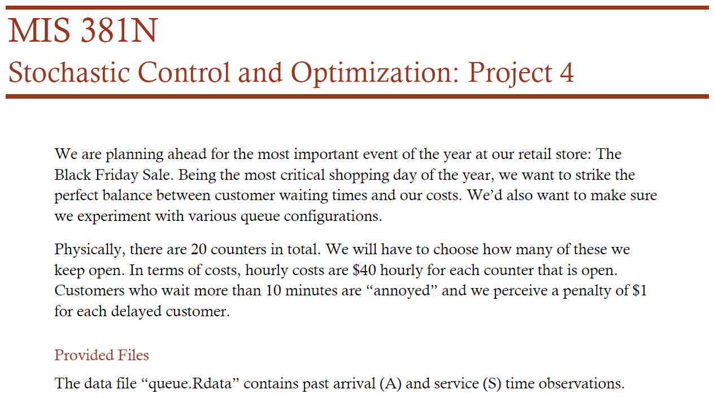
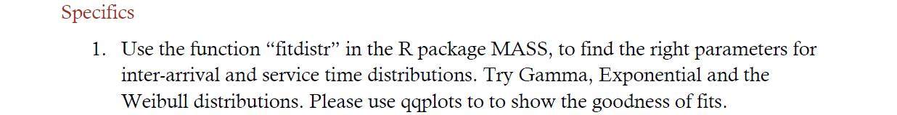
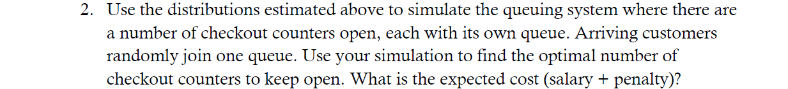
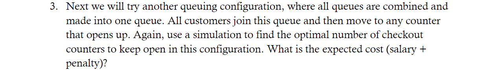
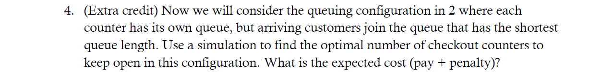

```{r, warning=FALSE}
rm(list=ls())
library(MASS)

load('queue.rdata')

inter_A = diff(A, lag=1) # calculate inter-arrival times

# fit arrival times to distributions
A_gamma = fitdistr(x=inter_A, densfun="gamma")
A_exp = fitdistr(x=inter_A, densfun="exponential")
A_weibull = fitdistr(x=inter_A, densfun="weibull")

# fit service times to distributions
S_gamma = fitdistr(x=S, densfun="gamma")
S_exp = fitdistr(x=S, densfun="exponential")
S_weibull = fitdistr(x=S, densfun="weibull")

# estimate inter-arrival times
A_gamma_est = rgamma(n=length(A), shape=A_gamma$estimate[1],rate=A_gamma$estimate[2])
A_exp_est = rexp(n=length(A), rate=A_exp$estimate[1])
A_weibull_est = rweibull(n=length(A), shape=A_weibull$estimate[1], scale=A_weibull$estimate[2])

# estimate service times
S_gamma_est = rgamma(n=length(S), shape=S_gamma$estimate[1], rate=S_gamma$estimate[2])
S_exp_est = rexp(n=length(S), rate=S_exp$estimate[1])
S_weibull_est = rweibull(n=length(S), shape=S_weibull$estimate[1], scale=S_weibull$estimate[2])

qqplot(inter_A, A_gamma_est, xlab='Past Inter-Arrival Time Observations', ylab='Estimated Inter-Arrival Distribution', main='qq plot for Gamma Estimate of Inter-Arrival Time')

qqplot(inter_A, A_exp_est, xlab='Past Inter-Arrival Time Observations', ylab='Estimated Inter-Arrival Distribution', main='qq plot for Exp Estimate of Inter-Arrival Time')

qqplot(inter_A, A_weibull_est, xlab='Past Inter-Arrival Time Observations', ylab='Estimated Inter-Arrival Distribution', main='qq plot for Weibull Estimate of Inter-Arrival Time')
```
  

  
To minimize cost, the store should have 15 counters open for black friday. The estimated cost is inidicated below under min(total_cost).
  
Cost was calculated using the formula: Overall Cost = [$1 X (Customers with Wait Time > 10)] +[$40/60 X No. Of minutes all counters are open]
```{r}
n = 10000 # 10,000 simulations
final_cost = rep(NA, 20) # vector to hold costs for each possible # of counters open
set.seed(400)

for (counter in 1:20) 
  {
    counter_choice = sample(1:counter, n, replace=TRUE) # simulate random selection of queue
    line = matrix(0, n, counter) # matrix with customer as row and counter as column; 1 indicates customer's counter choice
      for (j in (1:length(counter_choice))) # populate matrix
        {
        line[j,counter_choice[j]] = 1
      }
    # use gamma dist to simulate arrival and service times
    A_gamma_inter = rgamma(n=n-1, shape=A_gamma$estimate[1], rate=A_gamma$estimate[2])
    A_gamma_arrival = c(0, cumsum(A_gamma_inter))
    S_gamma_service = rgamma(n=n, shape=S_gamma$estimate[1], rate=S_gamma$estimate[2])
    cost = rep(NA, counter) # vector to hold cost of each counter
    D_max = rep(NA, counter) # max duration of a line
    for (k in (1:counter)) 
      {
        A_line = matrix(0, n, counter) # simulated arrival times
        S_line = matrix(0, n, counter) # simulated service times
        A_line[,k] = line[,k] * A_gamma_arrival
        serial = min(which(A_line[,k] != 0))
        A_line = A_line[,k][A_line[,k] > 0]
        S_line[,k] = line[,k] * S_gamma_service
        S_line = S_line[,k][S_line[,k] > 0]
        T = rep(NA,length(A_line)) # service start times
        D = rep(NA,length(A_line)) # durations
        W = rep(NA,length(A_line)) # wait times
        
        T[1] = min(A_line) # set first service start time as the first arrival time in the line
        D[1] = T[1] + S_line[serial] # set duration as the first arrival time + the first service time
        W[1] = 0 # set first wait time to 0
    
          for (i in 2:length(A_line)) # loop to calculate service times and durations
            {
              T[i] = max(D[i-1], A_line[i])
              D[i] = T[i] + S_line[i]
            }
        W = T - A_line # calculate wait times
        cost[k] = sum(W > 10) # calculate cost per line
        D_max[k] = max(D) # save max duration to use as minutes all counters are open for calculating final cost
      }
    final_cost[counter] = sum(cost, na.rm=TRUE) + 40 * max(D_max)/60 * counter
}

final_cost
plot(1:20, final_cost, type='line', xlab='# of Counters Open', ylab='Estimated Cost', main='Multiple Queues w/ Random Selection of Queue')
min(final_cost)
which.min(final_cost)
```
  

  
With 1 queue, the optimal number of counters is lower at 13. The estimated cost is inidicated below under min(cost_all). This tells us that 1 queue is more efficient than multiple queues with random selection.
```{r}
n = 5000 # simulate 5,000 customers
cost_all = rep(NA, 20) # vector to hold costs for each possible # of counters open

for (counter in 1:20) 
  {
    A_gamma_inter = rgamma(n=n-1, shape=A_gamma$estimate[1], rate=A_gamma$estimate[2])
    A_gamma_arrival = c(0, cumsum(A_gamma_inter))
    S_gamma_service = rgamma(n=n, shape=S_gamma$estimate[1], rate=S_gamma$estimate[2])
  
    D = rep(0, counter) # vector to hold service end times
    W = rep(NA, n) # wait times
    T = 0 # service start time
    D[1] = T + S_gamma_service[1] # first service end time = start time + first service time
    W[1] = 0 # first wait time is 0
    
    for (p in 2:n) # loop through customers
      {
        x = which.min(D) # assign each customer the counter with the least service end time
        old_D = D[x] # counter's previous service end time
        T = max(old_D, A_gamma_arrival[p]) # service start time = max of customer arrival time and old_D
        D[x] = T + S_gamma_service[p]
    
        W[p] = max((old_D - A_gamma_arrival[p]), 0) # if the customer arrives after the previous service end time, the wait time is 0
      }
    cost_all[counter] = sum(W > 10) + (max(D)/60 * 40 * counter)
}

cost_all
plot(1:20, cost_all, type='line', xlab='# of Counters Open', ylab='Estimated Cost', main='1 Queue')
min(cost_all)
which.min(cost_all)
```
  

  
The optimal number of counter for a multiple queuing system with shortest queue selection is 13, lower than it was with random selection. The cost is show below under min(cost_all) This makes sense because it is more efficient for customers to choose the shortest queue.
```{r}
n = 5000
cost_all = rep(NA,20)

for (counter in 1:20) 
  {
    A_gamma_inter = rgamma(n=n-1, shape=A_gamma$estimate[1], rate=A_gamma$estimate[2])
    A_gamma_arrival = c(0, cumsum(A_gamma_inter))
    S_gamma_service = rgamma(n=n, shape=S_gamma$estimate[1], rate=S_gamma$estimate[2])
    
    qlen = rep(0,counter) # length of queues for each of the counters
    D = rep(0,counter) # service end times
    qlen[1] = 1
    W = rep(NA,n)
    T = 0
    D[1] = T + S_gamma_service[1]
    W[1] = 0
    
    for (p in 2:n) 
    {
      qlen[(D<=A_gamma_arrival[p]) & (qlen!=0)] = qlen[(D<=A_gamma_arrival[p]) & (qlen!=0)] - 1 # if a customer arrives after the service end times of some counters, then qlen decreases by 1
      x = which.min(qlen) # customer chooses queue with shortest length
      qlen[x] = qlen[x]+1 # after customer joins the line, qlen increases by 1
      T = max(D[x], A_gamma_arrival[p])
      old_D = D[x]
      D[x] = T + S_gamma_service[p]
      
      W[p] = max((old_D - A_gamma_arrival[p]),0)
      
    }
    cost_all[counter] = sum(W > 10) + (max(D)/60 * 40 * counter)
    
}

cost_all
plot(1:20, cost_all, type='line', xlab='# of Counters Open', ylab='Estimated Cost', main='Multiple Queues w/ Shortest Selection')
min(cost_all)
which.min(cost_all)
```
