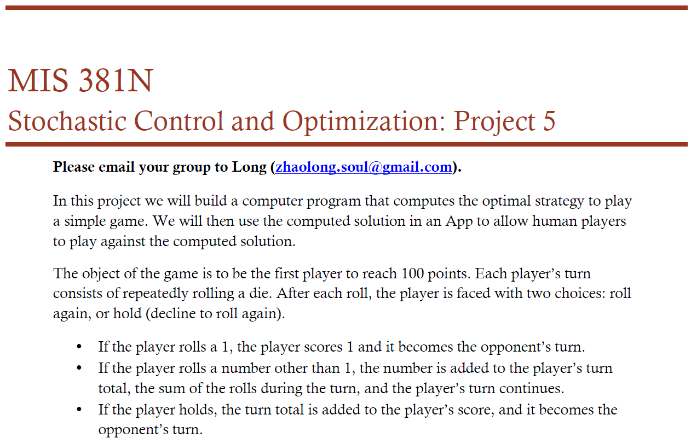
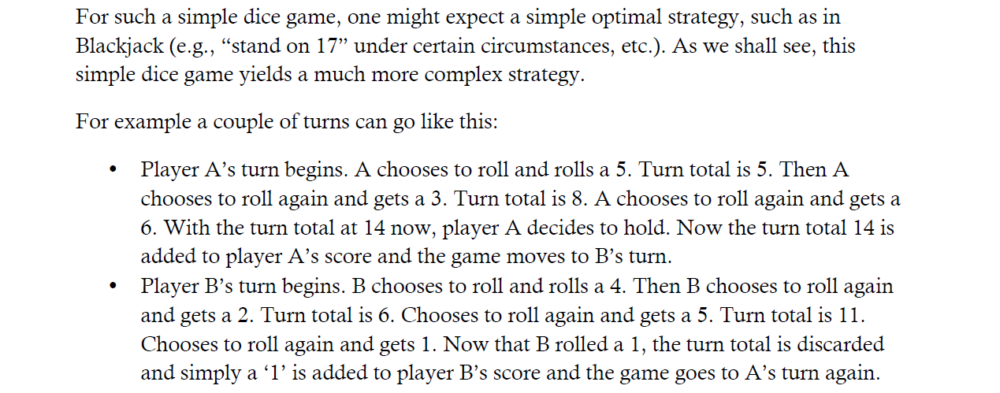
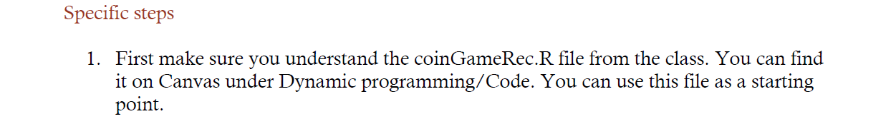
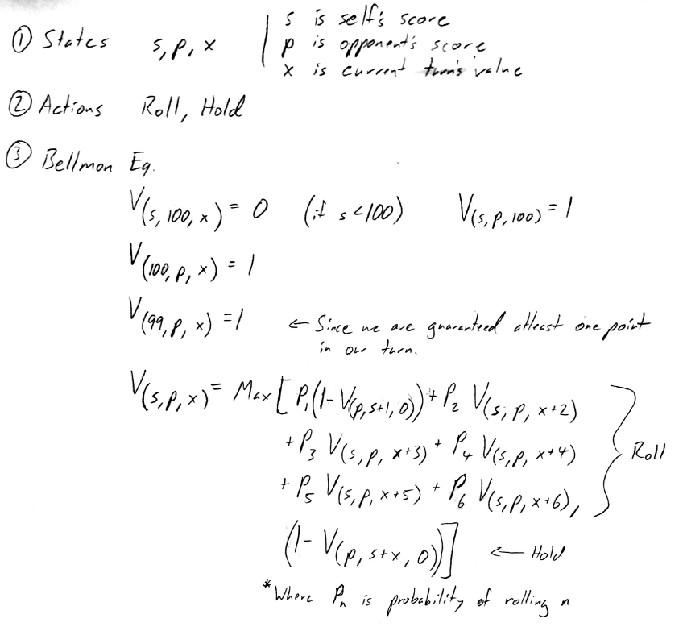
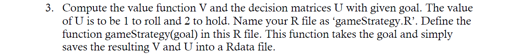
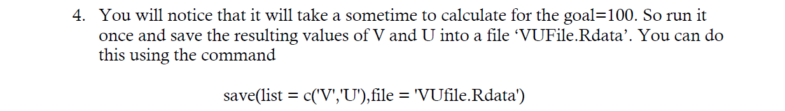
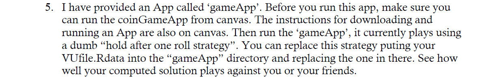
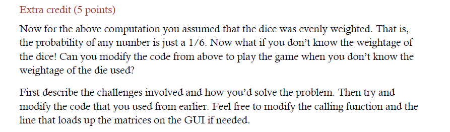
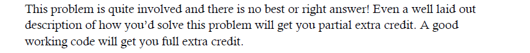

  

  

  

  

  

  

  

  
The challenge with not knowing the probability of a number appearing during a dice roll is that we can't calculate the V and U matrices beforehand. So what we did was play the first round with the assumption of a fair die and use the dice rolls from the first round to estimate the dice roll distribution. We would then pass the estimated probabilities into our dynamic program to re-calculate the V and U matrices for the next round.

In the folder "Bonus" we have provided the modified server.R file that, upon clicking new game, will estimate the new distribution and then call our function to re-calculate the V and U matrices. We also changed the dice to be biased, with roll probabilities of (0.2, 0.1, 0.3, 0.1, 0.2, 0.1). Be aware, that you must set the working directory to the server.R file's location and play one full game with the assumption that the dice is fair. After you finish one game, clicking "new game" will re-estimate the distribution and the next game will be run with the updated V/U matrices. Every additional game you play will improve the estimation of the distribution.